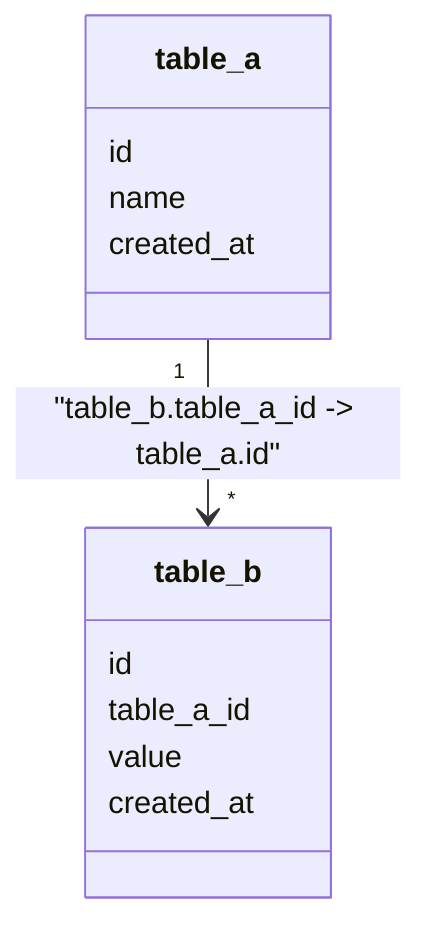

# <Domain Name> - Data Model

Status: CURRENT IMPLEMENTATION

This document is a visual-first reference for the database schema owned by this domain as actually implemented now.

## Diagram

Illustrative template syntax only. This is not Playhoot schema.



## Relationship Semantics

Use this canonical relationship-label convention:

```text
referencing_column -> referenced_column
```

The left side is the column storing the reference / foreign key. The right side is the referenced target column. Use this convention consistently regardless of the visual direction chosen for the Mermaid relationship/cardinality arrow.

When useful, distinguish:

- database-enforced FK relationship;
- logical persisted reference where the schema stores a related identifier but there is no database FK constraint.

Do not represent a logical reference as a database-enforced FK.

For a logical relationship, use a visually distinct relationship where possible and label it explicitly, for example:

```text
logical: sessions.game_version_id -> game_versions.id
```

Only document logical relationships that actually exist in current behavior.

## Large Domain Rule

Never remove columns simply to make a diagram fit. If one diagram becomes difficult to read, split this document into multiple diagrams by area.

Every table and column must still be represented somewhere. Every important relationship must be visible in at least one diagram.

## Diagram Requirements

- Show every persisted table owned by the domain.
- Show all columns for every represented table, including technical persisted columns such as timestamps when they actually exist.
- Use exact persisted table names.
- Use exact persisted column names.
- Show relationships with explicit column-to-column mapping.
- Show relationship cardinality where known.
- Reflect actual current migrations/persistence implementation.
- Never include a future table or column as though implemented.

## Do Not Include

- SQL types.
- ORM types.
- Indexes.
- Index names.
- Column sizes.
- Defaults.
- Implementation structs.
- Speculative future columns.

## Minimal Text

After diagrams, include only invariants or relationship semantics that cannot be understood visually. Do not turn this into prose schema documentation.
