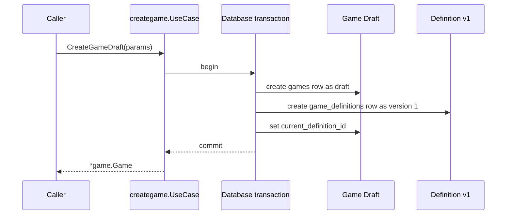

# Create Game Draft - Feature Design Review

Status: HUMAN DECISION REQUIRED

This workspace is temporary, non-canonical, and non-authoritative.

## What is already agreed

- Game Management creates a new Game and its initial definition atomically.
- The new Game starts as `game.Draft`.
- The initial definition is version `1` and becomes the Game's current definition.
- The initial definition is not published just because it exists.
- Draft creation does not require Engine playability validation.
- Scope ends at Game Management.
- Creation does not write `game_histories` or `game_definition_histories` merely because those tables exist.

Out of scope: API/HTTP, authentication, Identity/Profile implementation, AI generation, creation wizard, templates, publishing, discovery, sessions/rooms, multiplayer, editing, later versions, billing, and analytics.

## Proposed contract

The proposed public Game Management contract is:

```go
package creategame

import (
    "context"

    "github.com/diegobermudez03/playhoot/game/game"
    "github.com/diegobermudez03/playhoot/game/language/v1/program"
)

type Params struct {
    Name         string
    Description  string
    OwnerUUID    string
    LogoImageURL string
    Definition   program.Definition
}

func (c *UseCase) CreateGameDraft(
    ctx context.Context,
    params Params,
) (*game.Game, error)
```

The caller controls authored content: name, description, owner UUID, logo image URL, and the initial `program.Definition`.

Game Management controls lifecycle and version state: Game UUID, initial Definition UUID, visibility, version number, publication state, and current-definition linkage.

The caller does not provide `Visibility`, `VersionNumber`, `PublishedAt`, or `CurrentDefinitionID`.

## How creation behaves



## Why this contract

- `Params` avoids a growing positional public API.
- `CreateGameDraft` makes draft semantics explicit.
- The caller cannot inject internal lifecycle, publication, or version state.
- Returning `*game.Game` reuses the current Game-domain result model instead of adding a new public DTO without a clear reason.
- `program.Definition` matches the existing authored definition model; current storage already encodes definitions through the Game Language v1 JSON representation.

## Alternatives worth knowing

- `CreateGame` instead of `CreateGameDraft`: shorter, but less explicit that this operation always creates a draft.
- Positional arguments instead of `Params`: workable now, but brittle if the creation inputs grow.
- Separate creation-result DTO: possible, but not currently justified because `game.Game` already carries the Game UUID, version UUID, metadata, visibility, and definition.

## Decision needed from you

Please decide whether to:

APPROVE the proposed public contract.

MODIFY the proposed public contract.

REJECT the proposed public contract.

The public contract above is PROPOSED, NOT HUMAN-APPROVED.

No additional material decisions were discovered during this review.

## What happens after approval

- The decision will be persisted into the DRAFT WORK.
- The AI will run Definition-of-Ready validation.
- You will receive a concise READY REVIEW.
- Implementation still does not begin until you explicitly approve the WORK as READY.
