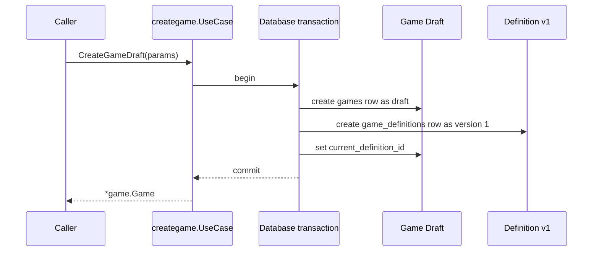

# Create Game Draft - READY Review

Status: READY APPROVAL REQUIRED

This workspace is temporary, non-canonical, and non-authoritative.

## Outcome

This WORK will add the Game Management operation that creates a newly authored game draft together with its initial definition, so the creation flow can persist its first durable Game record.

## Approved Behavior

- Game and initial definition creation is atomic.
- The new Game is created as `game.Draft`.
- The initial definition is version `1`.
- The initial definition becomes the Game's current definition.
- The initial definition remains unpublished.
- Draft creation does not require Engine playability validation.
- Creation does not write game or game-definition history records.
- The public create-draft contract is approved.

## Approved Public Contract

```go
package creategame

import (
    "context"

    "github.com/diegobermudez03/playhoot/game/game"
    "github.com/diegobermudez03/playhoot/game/language/v1/program"
)

type Params struct {
    Name         string
    Description  string
    OwnerUUID    string
    LogoImageURL string
    Definition   program.Definition
}

func (c *UseCase) CreateGameDraft(
    ctx context.Context,
    params Params,
) (*game.Game, error)
```

The caller provides authored content. Game Management generates the Game UUID and initial Definition UUID, sets Draft visibility, sets definition version `1`, keeps the definition unpublished, and links it as current.

## Scope

In scope:

- Game Management create-draft use case and repository behavior.
- Persisting the Game row, initial Definition row, and current-definition linkage.
- Returning `*game.Game`.
- Focused service and repository tests.

Out of scope:

- API/HTTP, authentication, Identity/Profile implementation, AI generation, creation wizard, templates, publishing, discovery, sessions/rooms, multiplayer, editing, later versions, billing, analytics, schema changes, ADRs, and PDRs.

## Behavior



## Observable Outcomes

- A successful request creates one draft Game and one initial Definition.
- The created Definition is version `1`, unpublished, and current for the Game.
- A failed multi-step creation leaves no partial Game or Definition behind.
- Existing playable-game retrieval behavior remains unchanged.

## Verification

Implementation will add service and repository tests covering successful creation, persisted state, atomic rollback behavior, error behavior, and the absence of Engine playability validation during draft creation.

## Documentation Impact

After implementation, current-state documentation should be updated:

- `game/CURRENT_STATE.md`
- `game/docs/FLOWS.md`

Expected unchanged:

- domain boundary
- architecture
- DB schema

## Remaining Blockers

None.

## Decision Needed

If this accurately represents what you want implemented, reply:

READY

Otherwise describe what you want changed.

READY authorizes implementation of exactly the approved WORK. It does not authorize scope expansion or new material decisions.

After READY, the AI will transition `WORK-0001` from DRAFT to READY, remove the temporary design workspace once the durable WORK is sufficient, and provide the minimal Codex implementation handoff.
