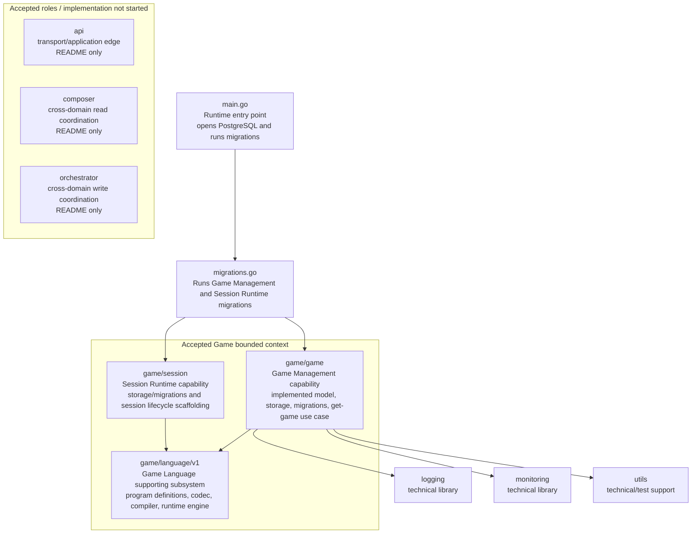

# System Map

Status: CURRENT IMPLEMENTATION

## Repository Boundary Notes

- Some top-level directories represent unresolved/provisional boundaries.
- API, Composer, and Orchestrator currently exist as documented roles, not runtime implementations.
- See `../../ARCHITECTURE.md` for accepted architecture rules.
