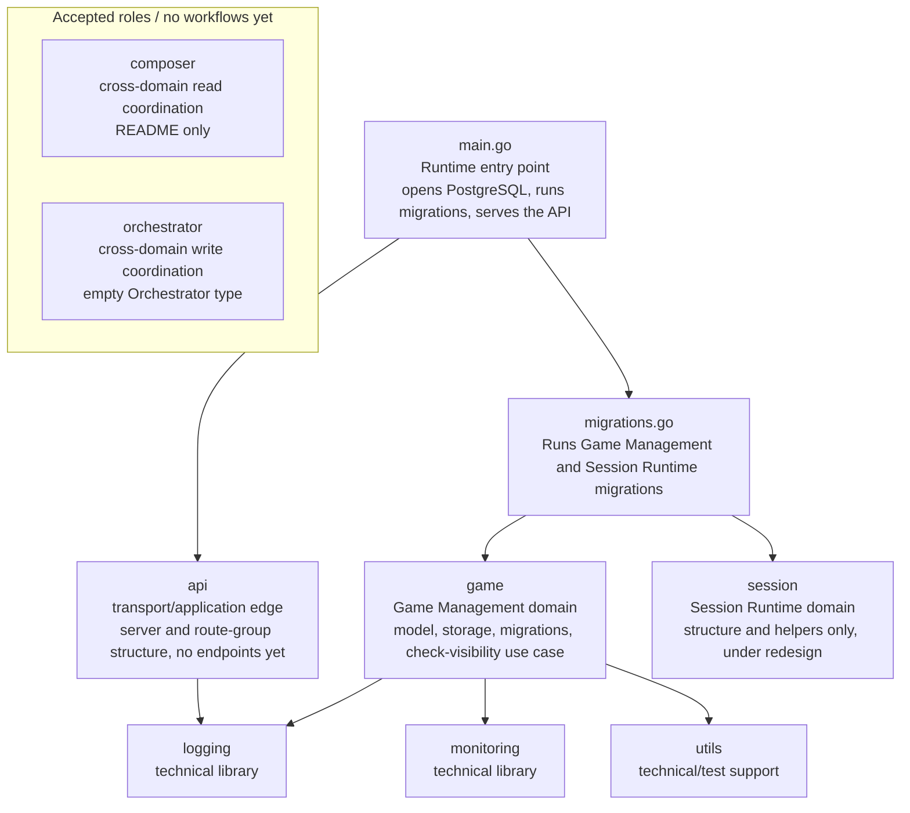

# System Map

Status: CURRENT IMPLEMENTATION

```mermaid
flowchart TB
    Main["main.go\nRuntime entry point\nopens PostgreSQL, runs migrations, serves the API"]
    Migrations["migrations.go\nRuns Game Management and Session Runtime migrations"]
    API["api\ntransport/application edge\nserver and route-group structure, no endpoints yet"]

    GM["game\nGame Management domain\nmodel, storage, migrations, check-visibility use case"]
    SR["session\nSession Runtime domain\nstructure and helpers only, under redesign"]

    Logging["logging\ntechnical library"]
    Monitoring["monitoring\ntechnical library"]
    Utils["utils\ntechnical/test support"]

    subgraph DocumentedRoles["Accepted roles / no workflows yet"]
        Composer["composer\ncross-domain read coordination\nREADME only"]
        Orchestrator["orchestrator\ncross-domain write coordination\nempty Orchestrator type"]
    end

    Main --> Migrations
    Main --> API
    Migrations --> GM
    Migrations --> SR
    API --> Logging
    GM --> Logging
    GM --> Monitoring
    GM --> Utils
```

Game Management and Session Runtime are independent top-level business domains, not capabilities nested under a shared "Game" bounded context (`docs/decisions/architecture/ADR-0014-management-session-domain-split.md`). Session Runtime is being redesigned as a real-time runtime (`session/docs/decisions/SESSION-ADR-0028-real-time-session-runtime-supersedes-discrete-turn-architecture.md`); its current contents are described in `session/CURRENT_STATE.md`.

## Repository Boundary Notes

- Some top-level directories represent unresolved/provisional boundaries.
- Composer and Orchestrator exist as documented roles with no implemented workflows.
- See `../../ARCHITECTURE.md` for accepted architecture rules.
