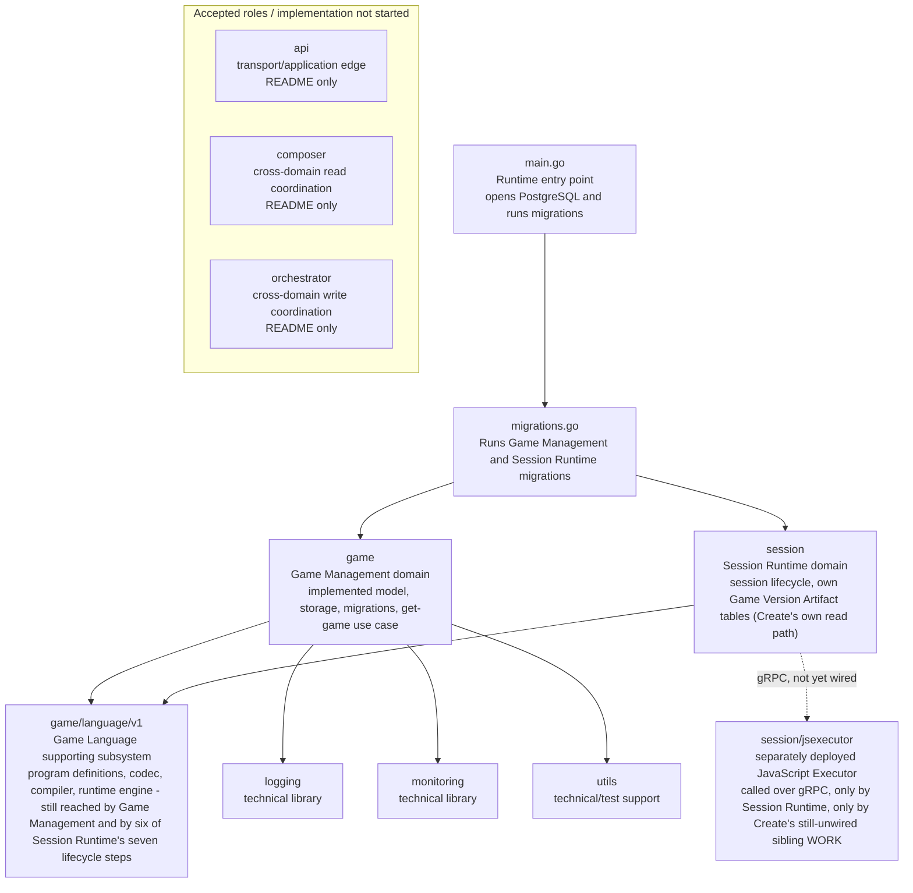

# System Map

Status: CURRENT IMPLEMENTATION

```mermaid
flowchart TB
    Main["main.go\nRuntime entry point\nopens PostgreSQL and runs migrations"]
    Migrations["migrations.go\nRuns Game Management and Session Runtime migrations"]

    GM["game\nGame Management domain\nimplemented model, storage, migrations, get-game use case"]
    SR["session\nSession Runtime domain\nsession lifecycle, own Game Version Artifact tables (Create's own read path)"]
    GL["game/language/v1\nGame Language supporting subsystem\nprogram definitions, codec, compiler, runtime engine - still reached by Game Management and by six of Session Runtime's seven lifecycle steps"]
    JSExec["session/jsexecutor\nseparately deployed JavaScript Executor\ncalled over gRPC, only by Session Runtime, only by Create's still-unwired sibling WORK"]

    Logging["logging\ntechnical library"]
    Monitoring["monitoring\ntechnical library"]
    Utils["utils\ntechnical/test support"]

    subgraph DocumentedRoles["Accepted roles / implementation not started"]
        API["api\ntransport/application edge\nREADME only"]
        Composer["composer\ncross-domain read coordination\nREADME only"]
        Orchestrator["orchestrator\ncross-domain write coordination\nREADME only"]
    end

    Main --> Migrations
    Migrations --> GM
    Migrations --> SR
    GM --> GL
    SR --> GL
    SR -. gRPC, not yet wired .-> JSExec
    GM --> Logging
    GM --> Monitoring
    GM --> Utils
```

Game Management and Session Runtime are independent top-level business domains, not capabilities nested under a shared "Game" bounded context (`docs/decisions/architecture/ADR-0014-management-session-domain-split.md`). Game Language remains a supporting subsystem both still depend on; retiring that dependency for Session Runtime's own six remaining lifecycle steps, in favor of the separately deployed JavaScript Executor, is `docs/projects/active/js-runtime-migration/works/WORK-0038-snapshot-based-session-runtime-persistence-migration.md`'s own scope.

## Repository Boundary Notes

- Some top-level directories represent unresolved/provisional boundaries.
- API, Composer, and Orchestrator currently exist as documented roles, not runtime implementations.
- See `../../ARCHITECTURE.md` for accepted architecture rules.
