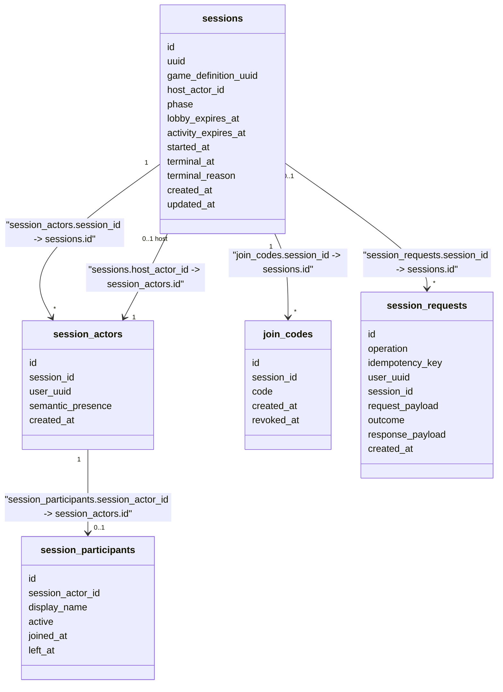
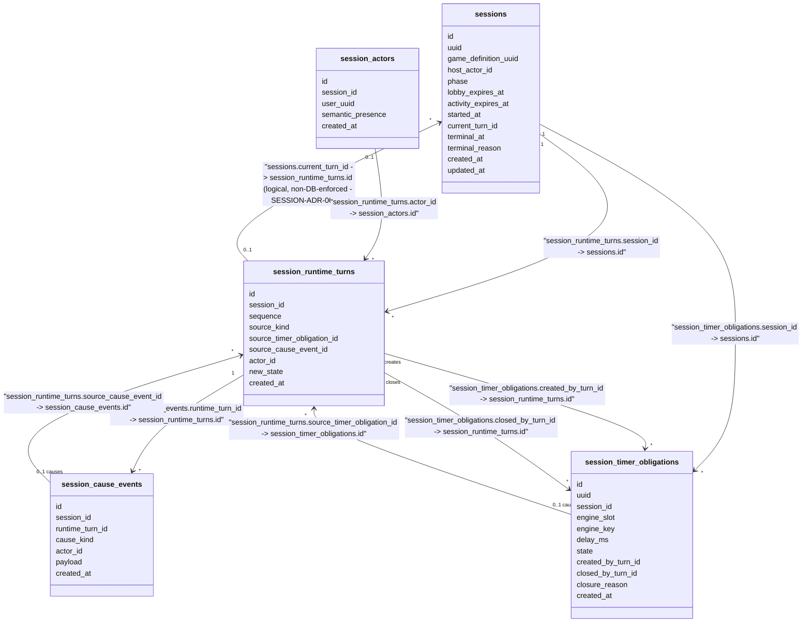
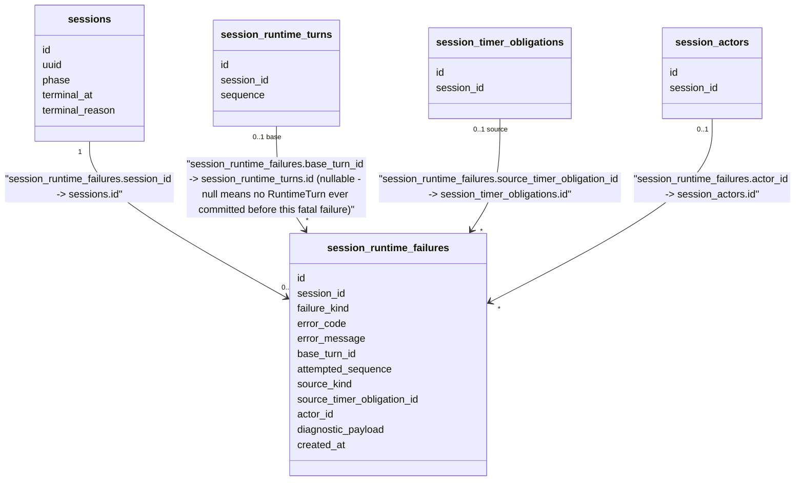
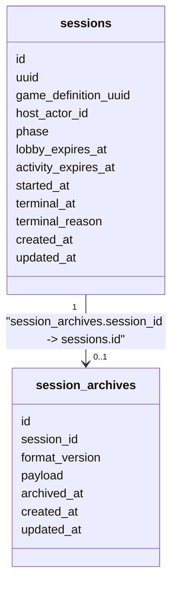

# Session Runtime - Persistence Model

Status: PARTIALLY IMPLEMENTED. The core persistence mechanism (this file's
"Snapshot-Based Persistence Model" section, and the parts of "Runtime
History Tables"/"Recovery"/"Process-Agnostic Recovery" it revises) is
implemented and current-truth as of `WORK-0038`. The remaining sections
below it (SessionActor semantic presence disconnect/reconnect consequences,
archival/hard-delete, no-durable-outbox) describe accepted design for
capabilities the `session-runtime-v1` initiative has not yet built against
this mechanism and remain forward-looking, not current implementation. For
the actually persisted schema, see `session/docs/DATA_MODEL.md`.

## Snapshot-Based Persistence Model (SESSION-ADR-0025)

Session Runtime persists the current authoritative Runtime state directly,
as an opaque value, rather than reconstructing it live by replaying a
durable input log:

```text
Pinned Game version artifact (the backend script session_game_version_artifacts.backend_script_key locates in object storage)
        +
session_runtime_turns.new_state (the authoritative state immediately after
        the row sessions.current_turn_id currently points at)
        ↓
passed directly as the next Execute call's PreviousState - no
reconstruction step of any kind
```

**What is durable**: `session_runtime_turns` carries `new_state`, the
opaque authoritative state a committed Turn produced, stored exactly as the
Executor returned it and never decoded/interpreted by Session Runtime
itself. "Current state" for any RUNNING-phase operation is simply this
column for the row `sessions.current_turn_id` points at - no second table
kept in sync, and no in-memory reconstruction step of any kind.

**What is retained for reconstruction/audit only, never the live-
correctness path**: `session_runtime_turns`'s own ordered replay-input
envelope (`session_id`, `sequence`, `source_kind`,
`source_timer_obligation_id`, `source_cause_event_id`, `actor_id`,
`created_at`), `session_runtime_starts` (Start's own seed/root parameters),
`session_cause_events` (a submitted player event's or manual
cancellation's own durable payload), and `session_timer_obligations`. These
tables answer "what durable causes happened, in what order" for a future,
not-yet-implemented best-effort reconstruction/audit capability; nothing
reads them to determine live current state. Strict deterministic replay is
explicitly not required or relied upon - a fresh execution's random seed is
drawn fresh per call, not derived to reproduce a specific prior run.

**What is never persisted**: any push-style client-facing output
(equivalent to a prior "Effect"/"Presentation" concept). A per-player view
is obtained through a separate, pull-based call against current state, not
carried on any Turn-producing operation's own result.

**Recovery** loads `sessions.current_turn_id`'s own `new_state` directly -
a process resuming a `RUNNING` Session never reconstructs state by
replaying anything. See "Process-Agnostic Recovery" below.

Rationale and alternatives are recorded in
`session/docs/decisions/SESSION-ADR-0025-snapshot-based-session-runtime-persistence.md`
(supersedes `SESSION-ADR-0023-replay-first-session-runtime-persistence.md`
below, which is retained as historical record only, per this repository's
immutability convention for accepted decisions once superseded).

Rationale and alternatives are recorded in:

- `session/docs/decisions/SESSION-ADR-0006-session-runtime-turn-and-persistence-model.md` (RuntimeTurn as the historical unit, RuntimeStep as technical trace, the core tables, Turn/Interaction/Timer relationships; its Snapshot-persistence portion is superseded by SESSION-ADR-0023 above).
- `session/docs/decisions/SESSION-ADR-0007-session-runtime-v1-timer-recovery-simplification.md` (no durable `live_timer_schedules`, V1 recovery tradeoff).
- `session/docs/decisions/SESSION-ADR-0008-session-runtime-history-archival-and-hard-delete.md` (archive-metadata-entity concept and verified hard-delete policy; its GCS-storage-location portion is superseded by SESSION-ADR-0023 above).
- `session/docs/decisions/SESSION-ADR-0023-replay-first-session-runtime-persistence.md` (replay-first persistence model above: no durable per-Turn Snapshot, PostgreSQL JSONB archive, the audited replay-input catalog).
- `session/docs/decisions/SESSION-ADR-0024-role-aware-live-connections.md` (ADMIN/PARTICIPANT connection-role distinction; does not change this document's persisted-schema scope, referenced here for completeness).
- `session/docs/decisions/SESSION-ADR-0011-game-language-keyed-timer-slots.md` (keyed timer slot capability and the `session_timer_obligations.engine_key` persistence consequence below).
- `session/docs/decisions/SESSION-ADR-0012-session-runtime-process-agnostic-recovery.md` (process-agnostic recovery, RuntimeTurn crash/commit semantics, reconstruction from current checkpoint rather than event replay).
- `session/docs/decisions/SESSION-ADR-0013-session-runtime-durable-inactivity-expiration.md` (`activity_expires_at` as the RUNNING-phase inactivity deadline and source of truth, renewal, lazy materialization, Reaper role, and the Archive Worker boundary below).
- `session/docs/decisions/SESSION-ADR-0014-session-actor-semantic-presence-and-lobby-membership.md` (`session_actors.semantic_presence`, its distinction from `session_participants.active`, and phase-dependent LOBBY/RUNNING disconnect consequences below).
- `session/docs/decisions/SESSION-ADR-0015-session-semantic-presence-recovery-after-total-coordinator-state-loss.md` (recovery-grace behavior after total Coordinator/process loss and the RUNNING atomic semantic-presence/Game-Language-processing rule in the Process-Agnostic Recovery section below; introduces no new durable field/table).
- `session/docs/decisions/SESSION-ADR-0016-session-runtime-failure-classification-and-diagnostic-persistence.md` (the four-class failure taxonomy, the `session_runtime_failures` diagnostic entity introduced below, the RuntimeTurn failure boundary, atomic fatal materialization, and the archival/queryability exception below).
- `session/docs/decisions/SESSION-ADR-0017-session-running-mutation-serialization.md` (RUNNING mutations serialize per Session using the same DB-locking mechanism as LOBBY; a RuntimeTurn reloads current state after obtaining serialization; authoritative ordering is defined by serialization/Turn sequence, not arrival timestamps).
- `session/docs/decisions/SESSION-ADR-0018-runtimeturn-execution-bound-and-terminal-cleanup.md` (the `MAX_STEPS_PER_RUNTIME_TURN` bound and its fatal-overflow diagnostic below; the no-ACTIVE-obligations-after-terminalization invariant and closure-provenance fields introduced below; `session_runtime_failures.base_turn_id` nullability and pre-first-Turn fatal Start semantics).
- `session/docs/decisions/SESSION-ADR-0019-session-runtime-post-commit-client-delivery-semantics.md` (durable commit is the correctness boundary; no generic durable client-delivery outbox in V1; resync recovers current truth rather than replaying missed messages; presentation-only effects may be lost).
- `session/docs/decisions/SESSION-ADR-0022-session-runtime-current-turn-pointer-on-sessions.md` (refines SESSION-ADR-0006: the current-authoritative-Turn pointer is `sessions.current_turn_id`, not a separate `session_runtime_state` table).

## Central Concept: RuntimeTurn vs RuntimeStep

One `RuntimeTurn` begins from one external/runtime cause and may execute 1..N internal `engine.Step` calls, all within the same transaction. Only the final Snapshot after the whole Turn is an observable/authoritative Session state; one committed Turn corresponds to one Session runtime `sequence` and one historical Snapshot.

`RuntimeStep` is technical execution history only (engine debugging/audit). It does not own a Session-state sequence.

A RuntimeTurn's internal `engine.Step` chain is bounded by a Session-level `MAX_STEPS_PER_RUNTIME_TURN = 20` (V1 value, code/configuration-defined, not durably persisted per Session), counting every `Step` call in the Turn - the initial externally-caused `Step` plus every subsequent `Step` caused by draining a prior `Step`'s `InternalSignals` - distinct from `engine.Limits`, which bounds work inside one `Step` call only. Exceeding this bound is a deterministic fatal failure recorded through `session_runtime_failures` below (`failure_kind = RUNTIME_EXECUTION`, a stable `runtime_turn_step_limit_exceeded`-equivalent `error_code`); no partial RuntimeTurn is persisted. See SESSION-ADR-0018.

RUNNING-phase RuntimeTurn creation participates in the same per-Session serialization boundary already used for LOBBY mutations (database-backed pessimistic locking within Session Runtime's transaction boundary); a RuntimeTurn always executes against `sessions.current_turn_id`/Snapshot reloaded after that serialization is acquired, never against a pre-lock read. See SESSION-ADR-0017.

## SessionActor Semantic Presence vs Participant Admission

`session_actors.semantic_presence` (`CONNECTED | DISCONNECTED`) is a durable platform/runtime fact: has this SessionActor crossed the Coordinator -> Session semantic connected/disconnected boundary? It is not physical connection state - socket IDs, connection IDs, live WebSocket bindings, Coordinator grace timers, and process IDs remain ephemeral Coordinator-owned state and are never persisted here. `semantic_presence` only changes after the Coordinator's transport grace has already been applied and has already expired (see SESSION-ADR-0009, SESSION-ADR-0014).

`session_participants.active` answers a different, phase-dependent question: does this actor currently occupy/admit a participant position? During `LOBBY`, `active` means currently admitted / currently occupying a Start-eligible lobby slot, and a semantic disconnect deactivates it (releasing the slot) exactly as a `Leave` would. After `Start`, the Game runtime roster is the immutable initial set of active Participants selected at the serialized Start moment; a later semantic disconnect during `RUNNING` does **not** deactivate `session_participants.active` or free that roster position - RUNNING disconnect consequences are delegated to authored Game Language (`UserDisconnected`/`UserReconnected`, SESSION-ADR-0010), not decided by `active`.

These two fields may legitimately diverge - for example, a SessionActor reconnects successfully (`semantic_presence = CONNECTED`) while the lobby is already full, so its Participant remains inactive (`active = false`) and no slot is reserved. See SESSION-ADR-0014 for the full accepted phase-dependent rule set (LOBBY disconnect/reconnect admission, the Start active-Participants-only roster, and RUNNING disconnect preserving runtime membership).

## Lobby And Identity Tables



Logical cross-capability reference within Game (no database FK, same bounded context - GAME-ADR-0001):

- `sessions.game_definition_uuid` -> Game Management `game_definitions.uuid`.

Logical cross-domain references (no database FK, different bounded context):

- `session_actors.user_uuid` -> Identity `User.user_uuid`.
- `session_requests.user_uuid` -> Identity `User.user_uuid`.

## Runtime History Tables

Status: revised by SESSION-ADR-0025 - `session_runtime_turns.new_state`
carries the authoritative state directly; `session_interactions` (a durable
"open interaction" concept) is retired outright, since the platform's
closed Event/Command vocabulary has no equivalent - every game-defined
player action is a generic player event with no platform-level open/closed
lifecycle of its own.



`sessions.current_turn_id` points at the row whose own `new_state` is the
Session's current authoritative Runtime state (SESSION-ADR-0022's "no
separate `session_runtime_state` table" holds unchanged). No
reconstruction of any kind is needed to read current state - see
"Snapshot-Based Persistence Model" above.

`session_runtime_steps` (a technical-only intra-Turn execution trace under
the retired engine) is removed along with it: the Executor is a single
opaque call with no internal Step-chain of its own kind for Session
Runtime to record.

### Turn / Cause Event / Timer Worked Example

Player event flow:

```text
Player submits event -> causes Turn 12   (Turn12.source_cause_event_id = the
        session_cause_events row durably recording that event's payload)
```

Timer flow:

```text
Turn 20  -> creates Timer T1            (T1.created_by_turn_id = 20)
Coordinator reports T1 elapsed -> causes Turn 25   (Turn25.source_timer_obligation_id = T1)
Turn 25  -> closes T1                   (T1.closed_by_turn_id = 25, T1.state = CONSUMED)
```

A Turn may instead close a timer with `state = CANCELLED` without that timer ever being the Turn's `source`.

### Terminal Cleanup: Closure Provenance

`closed_by_turn_id` on `session_timer_obligations` is nullable. A non-null value means a committed RuntimeTurn closed the obligation (gameplay/runtime closure, per the worked example above). Once a Session becomes `TERMINAL` for any reason, every still-`ACTIVE` timer obligation is cancelled atomically in the same transaction that materializes `TERMINAL` - this is Session lifecycle cleanup, not gameplay: no RuntimeTurn is created and no timer expiration is fabricated. For this termination-caused closure, `closed_by_turn_id = NULL` and `closure_reason` records a value equivalent to `SESSION_TERMINATED`, distinguishing it from ordinary Turn-produced closure. `closure_reason` only explains why this specific row stopped being active - it does not duplicate the Session's own `terminal_reason`; investigating why the Session terminated follows the Session lifecycle/failure metadata instead. A `TERMINAL` Session must never retain an `ACTIVE` timer obligation. See SESSION-ADR-0018.

## Session Runtime Failure Diagnostics

`session_runtime_failures` is a conceptual future entity, separate from `session_runtime_turns` and not owning an authoritative Snapshot, that durably records a fatal (`RUNTIME_EXECUTION`/`RUNTIME_STATE_INVALID`) runtime failure - the technical diagnosis of *why* a Session became `TERMINAL` from an internal execution/state failure, not an authoritative gameplay record. See SESSION-ADR-0016 for the full four-class failure taxonomy (expected rejection, deterministic execution failure, durable state invalidity, transient infrastructure failure) and the reasoning behind this entity.



Cardinality notes:

- A Session normally has zero fatal `session_runtime_failures` records for its entire lifetime (the common case), or exactly one, since a fatal failure terminalizes the Session and a `TERMINAL` Session does not resume executing to fail again. This document does not freeze a database uniqueness constraint on `(session_id)` unless a later repository-convention review clearly warrants one; the relationship above is drawn as `0..*` to avoid over-constraining an unimplemented design.
- `base_turn_id` is nullable. A non-null value means a last-valid committed Turn existed before the fatal attempt, including a Turn as early as the Start-produced initial Turn. A null value means the fatal failure occurred before any RuntimeTurn ever committed for this Session - for example, a failure during Start's own first execution. `attempted_sequence = 1` remains valid diagnostic annotation even when `base_turn_id` is null.
- `error_code` is the one stable code the Executor-driven fatal path records (an infrastructure-level failure carries a free-form reason/cause, not a closed enum); `failed_step_index`/per-step diagnostic detail does not apply under this execution model.
- `source_timer_obligation_id`/`actor_id` are nullable, mirroring the equivalent nullable `source_*` fields already accepted on `session_runtime_turns`.
- `attempted_sequence` and `failed_step_index` are plain diagnostic integers, not foreign keys - they do not reference any row in `session_runtime_turns`/`session_runtime_steps`, since the attempted Turn/Step never committed and therefore never existed as a persisted row (see SESSION-ADR-0016's RuntimeTurn failure boundary).
- `SessionRuntimeFailure` is not a RuntimeTurn: it owns no Snapshot, does not advance `sessions.current_turn_id`, and is never itself the `base_turn_id`/`source_*` target of another Turn or failure record.

## No Durable `live_timer_schedules` In V1

`live_timer_schedules` (a previously proposed Coordinator-owned durable physical-schedule table) is rejected for V1 and is not part of this schema. Session Runtime persists only the timer obligation and its `delay_ms`; it does not calculate or persist an absolute deadline. The Coordinator owns physical timers in memory. On recovery, active obligations may be rescheduled using their full configured `delay_ms` from the new scheduling moment; preserving elapsed wall-clock time across a full process restart is not required for V1. See SESSION-ADR-0007.

`lobby_expires_at` on `sessions` is unrelated to this rule - it is an existing accepted Session lifecycle deadline, not a Game Language timer schedule.

## Keyed Timer Discriminator

`session_timer_obligations.engine_key` is a nullable internal Session/engine routing field accepted alongside `engine_slot`/`delay_ms`/`state`/Turn relationships, to support the accepted Game Language keyed-timer-slot capability (SESSION-ADR-0011):

- Ordinary `TimerSlot` timer: `engine_slot = ...`, `engine_key = NULL`.
- Keyed timer: `engine_slot = ...`, `engine_key = <serialized authored key>`.

**Correction (2026-09-25, WORK-0012 drafting)**: this table has no `engine_path` column. Unlike questions (which carried `engine_path`/`engine_slot` before WORK-0026/WORK-0027 replaced that addressing with `engine_interaction_id`), `engine.ScheduleTimerOutput`/`CancelTimerOutput`/`ScheduleKeyedTimerOutput`/`CancelKeyedTimerOutput` and `Signal`'s timer-addressing fields have never carried a `Path` field, in this repository's entire history - `engine_path` was never grounded in an actual engine field for timers and was likely copied from the interaction pattern when this document/SESSION-ADR-0011/SESSION-ADR-0006 were originally written. `engine_slot` alone (plus `engine_key` for keyed timers) is a Session's sole timer-instance addressing, consistent with the flat, single-instance execution model GAME-ADR-0026 accepts.

`engine_key` is internal Session/engine routing metadata only - it exists so Session Runtime can reconstruct the correct `KeyedTimerExpiredSignalSource` signal (carrying the authored `engine.Value` key) on recovery. It must never be exposed directly to Coordinator/frontend merely because it is persisted. The Game Language compiler/engine side of keyed timer slots (`KeyedTimerSlotDeclaration`, an arbitrary compiled `KeyType`) is implemented (WORK-0025); `session_timer_obligations` itself, including `engine_key`'s concrete serialized column representation, is designed by `docs/projects/active/session-runtime-v1/works/WORK-0012-timer-obligations.md`.

## Process-Agnostic Recovery

Session Runtime does not persist any process/instance ownership state (no `owner_process_id`, no heartbeat, no fencing/takeover generation, no durable `RECOVERING` phase). Recovery of a `RUNNING` Session reads current state directly from `sessions` (including `current_turn_id`) and `session_runtime_turns.new_state` for the row it points at, plus active `session_timer_obligations` for immediate operational needs - no reconstruction step of any kind. An uncommitted RuntimeTurn transaction at the moment of process death rolls back entirely via ordinary database transaction atomicity; a committed RuntimeTurn remains authoritative regardless of which process executed it or what happened immediately after commit. See SESSION-ADR-0012 and SESSION-ADR-0025.

Total process loss does not itself mutate `session_actors.semantic_presence` (SESSION-ADR-0014); durable `CONNECTED`/`DISCONNECTED` values are ordinary rows unaffected by ephemeral Coordinator state loss, requiring no recovery-specific persistence. For a RUNNING runtime member, the `semantic_presence` transition (`CONNECTED <-> DISCONNECTED`) and its corresponding authored-script reaction commit within one Session transaction, extending the same RuntimeTurn atomicity guarantee above to the presence mutation itself: if the transaction does not commit, the presence edge did not occur authoritatively and durable state remains at its prior value; if it commits, presence and any resulting RuntimeTurn/consequences are already authoritative together. No new column/table is introduced for this - `session_actors.semantic_presence` already exists (SESSION-ADR-0014), and Coordinator's post-crash recovery-grace mechanism remains entirely ephemeral, non-durable state. See SESSION-ADR-0015.

## RUNNING Inactivity Deadline: `activity_expires_at`

`sessions.activity_expires_at` is a durable inactivity deadline for `RUNNING` Sessions, distinct from `lobby_expires_at`. It is not a process ownership lease.

- **Source of truth**: expiration is true because `now >= activity_expires_at`, independent of whether/when a Reaper observes it.
- **Renewal**: meaningful Session operations (RuntimeTurn-producing gameplay, accepted interaction processing, timer expiration processing, meaningful lifecycle/runtime events, justified reconnect/resume activity) extend `activity_expires_at = now + inactivity_ttl`. `inactivity_ttl` is configurable operational/product policy (V1 illustrative value around 10 minutes), not a Game Language constant. Passive reads/polling must not renew it.
- **Validation**: any active-dependent operation must, under the same per-Session serialization used for other mutations, load/lock the Session, validate lifecycle, and compare `now` against `activity_expires_at` before processing; an operation arriving after the deadline must not revive a Session merely because persisted `phase` still reads `RUNNING`.
- **Lazy materialization**: such an operation may instead atomically materialize `phase = TERMINAL`, `terminal_reason = RUNTIME_INACTIVITY_EXPIRED`, `terminal_at = activity_expires_at` in the same transaction, then reject the original action - never renewing, reopening, fabricating gameplay, or creating a RuntimeTurn merely to represent expiration.
- **Reaper**: a background job proactively finds `phase = RUNNING AND activity_expires_at <= now` and, under the same serialization/revalidation rules, materializes `TERMINAL`/`RUNTIME_INACTIVITY_EXPIRED` if still expired; it does not determine expiration, only surfaces an already-true condition. If a legitimate operation already renewed the deadline first, the Reaper rechecks and does nothing.
- **`terminal_at` rule**: always equals `activity_expires_at`, never the Reaper's or a lazy operation's current wall-clock time - preserving the correct semantic terminal instant even across a long platform outage.
- **`terminal_reason = RUNTIME_INACTIVITY_EXPIRED`**: means only that the `RUNNING` Session exceeded its allowed inactivity period; it does not assert a process crash, pod kill, host disconnect, or that every participant left.
- **Archive Worker boundary**: the Archive Worker (see Archival And Hard-Delete Policy below) consumes only already-materialized `TERMINAL` Sessions per retention policy; it must not inspect process ownership, detect crashes, determine RUNNING inactivity, or interpret `activity_expires_at`.

Still-open `session_interactions`/`session_timer_obligations` at inactivity termination are closed/cancelled atomically as part of the same terminal-materialization transaction, under the general no-ACTIVE-obligations-after-terminalization invariant (see Terminal Cleanup: Closure Provenance above); materializing expiration must never fabricate engine responses or RuntimeTurns to close gameplay. See SESSION-ADR-0013, SESSION-ADR-0018.

## Archive Metadata (revised by SESSION-ADR-0023: PostgreSQL JSONB, not GCS)

Status: revised 2026-09-20. The archive destination moves from a GCS object-storage artifact to a same-database PostgreSQL JSONB record, since removing full-Snapshot persistence (see "Replay-First Persistence Model" above) removes the volume problem GCS archival existed to manage. The archive-metadata-entity concept and the verified-archival-before-hard-delete policy are otherwise unchanged from the original SESSION-ADR-0008 design.



`session_archives` (name illustrative - exact naming is WORK-0017/WORK-0019 implementation-planning detail) replaces the previously proposed `session_history_archives`. `payload` is a `JSONB` column holding the versioned archive artifact directly in PostgreSQL - no `storage_provider`/`storage_key`/`checksum`/external-object identifier is needed, since the artifact lives in the same row/database rather than an external object store. `format_version` is retained. There is normally at most one archive record per Session.

The archive payload contains what is required to understand/replay the completed Session, per SESSION-ADR-0023's replay-first model: pinned Game semantic/version identity, Start's Seed/RootParameters, the ordered replay-input history (interactions/responses, and, once each respective WORK lands, user-intent/timer-expiration/disconnect-reconnect/cancellation inputs), and terminal metadata. It does not include derived Snapshots, Presentations, or Effects - these remain excluded from the archive for the same reason they were never persisted live. The archive must eventually preserve whatever `engine_key`/keyed-timer metadata is necessary to understand/replay archived keyed-timer history (see SESSION-ADR-0011); the concrete archive JSON schema remains deferred here regardless, per SESSION-ADR-0008's still-valid "final JSON archive schema is deferred" stance.

## Archival And Hard-Delete Policy (revised by SESSION-ADR-0023: transactional same-database compaction)

Status: revised 2026-09-20. Because archive and source rows now live in the same database, the archival operation may use one straightforward transactional sequence rather than a separate archive-then-verify-then-delete workflow spanning two storage systems: build the archive payload, insert/mark the `session_archives` row, delete the removable source rows, commit - all in one transaction, idempotent under retry. If the transaction does not commit, no source row is deleted and no partial archive exists; this replaces the original GCS design's checksum-verification step, which existed specifically to guard against a cross-system write succeeding non-atomically - a same-database transaction removes that risk category outright. Archival before every removable row has a persisted archive to point back to (i.e. before the transaction that both writes the archive and deletes the source rows commits) must never occur; the underlying safety property (no hard delete without a durably persisted archive) is unchanged from the original SESSION-ADR-0008 policy, only the mechanism enforcing it is simpler.

Candidate removable hot runtime data (unchanged from the original policy):

- `session_runtime_turns`
- `session_runtime_steps` (if WORK-0019 retains it at all - see "Replay-First Persistence Model" above)
- `session_interactions`
- `session_timer_obligations`

Explicitly excluded from this deletion policy, and retained indefinitely for product queries (a User's session history, who hosted a Session, who participated):

- `sessions` (including `current_turn_id` - SESSION-ADR-0022: a logical, non-DB-enforced reference that keeps identifying the Session's last-current Turn even after that Turn's own row is hard-deleted, resolving against the archive record instead)
- `session_actors`
- `session_participants`

`session_runtime_failures` (see Session Runtime Failure Diagnostics above) is likewise excluded from this automatic hard-delete policy. Lightweight fatal-runtime-failure metadata remains relationally queryable in PostgreSQL after heavy runtime-history archival/compaction, supporting operational/product queries such as failure counts by error code or by game definition (see SESSION-ADR-0016). This is unlike the heavy per-Turn/per-Step tables above because failure records are low-volume by construction - a Session normally produces at most one. A separate retention/compaction strategy for large `diagnostic_payload` content may be designed later if payload volume ever warrants it; it is not designed here.

Retention of `session_requests`, `join_codes`, and other lightweight lifecycle metadata is unchanged by this decision.

## No Durable Client-Delivery Outbox

This accepted persistence model does not include a generic durable outbox for Coordinator/WebSocket/client delivery - no `session_delivery_outbox`, `delivery_attempts`, persistent connection delivery offset, or per-client ACK table. Durable commit (all tables above) is the correctness boundary; live delivery is best-effort against that already-durable state and never the reverse. A reconnecting client recovers current truth through the existing resync capability (see SessionActor Semantic Presence vs Participant Admission above and SESSION-ADR-0009), not through replaying a delivery log. See SESSION-ADR-0019 for the full rationale, including why this does not extend to a future Game Language output with an externally irreversible side effect.

The one class of output SESSION-ADR-0019 itself flagged as needing its own separate delivery decision - a confirmed `PLAYER_EVENT`'s own accepted/rejected/failed outcome - is resolved the same way, not by adding the durable outbox this section otherwise rejects: `session_requests` (already listed above) already durably records that outcome in the same transaction as the RuntimeTurn it resulted from, so a dedicated pull-based read (`Manager.GetSubmitPlayerEventOutcome`) recovers it on demand instead of a push-style dispatcher retrying delivery. See SESSION-ADR-0026 for the full rationale.

## Relationship Types

No database-enforced foreign key constraints are assumed by this accepted design, consistent with current Game migrations. All relationships above are logical persisted references unless a future implementation decision introduces enforced FKs.

Logical cross-capability reference within Game (no database FK, same bounded context, independent persistence/transaction ownership - GAME-ADR-0001):

- `sessions.game_definition_uuid -> game_definitions.uuid` (Game Management capability)

Logical cross-domain references (no database FK, different bounded context):

- `session_actors.user_uuid -> Identity.User` (Identity)
- `session_requests.user_uuid -> Identity.User` (Identity)

## Not Yet Decided

- The final JSON archive schema (now a PostgreSQL JSONB payload, not a GCS artifact - see SESSION-ADR-0023).
- The exact same-database archival/compaction transaction shape and its idempotency-under-retry mechanism (see SESSION-ADR-0023; WORK-0017/WORK-0019).
- `session_runtime_steps`'s final disposition (removed, bounded-retention, or unchanged) and the exact durable shape/table for Start's `Seed`/`RootParameters` and for each future RuntimeTurn cause without an existing normalized home (UserIntent arguments, SessionCancelled issuing actor, UserDisconnected/UserReconnected occurrence ordering) - see SESSION-ADR-0023; WORK-0019.
- Whether/how a future compiler/engine-build change is tracked beyond the existing pinned `program.Metadata.LanguageVersion`, for replay-compatibility purposes (see SESSION-ADR-0023's still-open versioning question).
- The idempotency JSON canonicalization/comparison algorithm for `session_requests`.
- The exhaustive `source_kind` and interaction/terminal-reason enums.
- `engine_key`'s serialized/typed column representation on `session_timer_obligations` (see SESSION-ADR-0011) - the Game Language `KeyedTimerSlotDeclaration` design itself is implemented, only its Session Runtime persistence encoding remains open.
- The exact enumeration of renewal-triggering operations for `activity_expires_at` and the concrete `inactivity_ttl` configuration surface (see SESSION-ADR-0013).
- The exact SQL types/column names, indexing, and any uniqueness constraint for `session_runtime_failures`; the concrete `diagnostic_payload` JSON schema/version; the exhaustive `failure_kind`/`source_kind` enums; and the large-diagnostic-payload retention/compaction strategy (see SESSION-ADR-0016).
- The exact SQL lock anchor/statement used to implement RUNNING (and LOBBY) per-Session serialization (see SESSION-ADR-0017).
- The exact `closure_reason`/equivalent enum values for `session_timer_obligations` (Slice 5, not yet implemented), and the exact `runtime_turn_step_limit_exceeded`-equivalent stable error-code string (see SESSION-ADR-0018). `MAX_STEPS_PER_RUNTIME_TURN` is implemented as `engine.Limits.MaxStepsPerTurn = 20`, enforced inside `engineservice.StartTurn`/`AdvanceTurn` (relocated from a `sessionlifecycle`-owned constant by GAME-ADR-0027); `session_interactions`' own `state`/`closure_reason` enum values (`ACTIVE | CLOSED | TERMINATED`, `SESSION_TERMINATED`) are implemented - see `game/docs/DATA_MODEL.md`.
