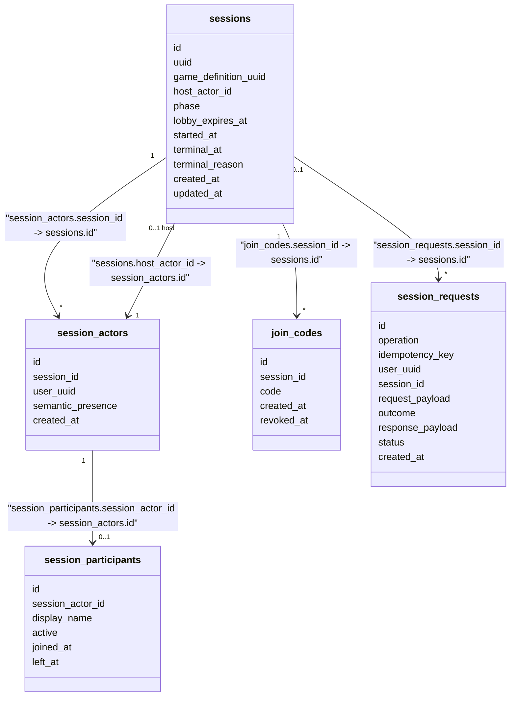

# Game - Data Model

Status: CURRENT IMPLEMENTATION

## Game Management Tables

```mermaid
classDiagram
    class games {
        id
        uuid
        name
        description
        owner_uuid
        current_definition_id
        logo_image_url
        visibility
        created_at
        updated_at
        deleted_at
    }
    class game_definitions {
        id
        uuid
        game_id
        version_number
        script
        published_at
        created_at
        updated_at
        disabled_at
    }
    class game_images {
        id
        game_id
        image_url
        created_at
        removed_at
    }
    class game_histories {
        id
        game_id
        name
        description
        logo_image_url
        visibility
        is_published
        created_at
    }
    class game_definition_histories {
        id
        game_definition_id
        script
        published_at
        disabled_at
        created_at
    }

    games "1" --> "*" game_definitions : "logical: game_definitions.game_id -> games.id"
    games "1" --> "*" game_images : "logical: game_images.game_id -> games.id"
    games "1" --> "*" game_histories : "logical: game_histories.game_id -> games.id"
    game_definitions "1" --> "*" game_definition_histories : "logical: game_definition_histories.game_definition_id -> game_definitions.id"
    games "0..1 current" --> "1" game_definitions : "logical: games.current_definition_id -> game_definitions.id"
```

## Session Runtime Tables

Status: this replaces the pre-Slice-1 `sessions`/`session_players`/`session_states`/`join_codes` shape - see WORK-0001's Data/Migration Impact. The full accepted design (including the not-yet-implemented RUNNING-phase tables) remains recorded in `game/docs/SESSION_RUNTIME_PERSISTENCE_MODEL.md`.



`phase` is `LOBBY | TERMINAL` in the currently implemented behavior (Create/Join/Leave); `RUNNING` is not yet reachable. `started_at` is always `NULL` in the currently implemented behavior.

## Relationship Types

No database-enforced foreign key constraints were found in the current Game migration SQL.

Logical persisted references:

- `game_definitions.game_id -> games.id`
- `game_images.game_id -> games.id`
- `game_histories.game_id -> games.id`
- `game_definition_histories.game_definition_id -> game_definitions.id`
- `games.current_definition_id -> game_definitions.id`
- `session_actors.session_id -> sessions.id`
- `sessions.host_actor_id -> session_actors.id`
- `session_participants.session_actor_id -> session_actors.id`
- `join_codes.session_id -> sessions.id`
- `session_requests.session_id -> sessions.id`

Logical cross-capability references within Game (no database FK, same bounded context, independent persistence/transaction ownership per GAME-ADR-0001):

- `sessions.game_definition_uuid -> game_definitions.uuid` (Game Management capability, read via the narrow `getgamedefinition`/`getgame` read capabilities, never queried directly from Session Runtime persistence)

Logical cross-domain references (no database FK, different bounded context):

- `session_actors.user_uuid -> Identity.User` (Identity)
- `session_requests.user_uuid -> Identity.User` (Identity)

External logical identifiers:

- `games.owner_uuid`
