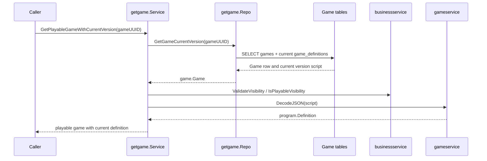
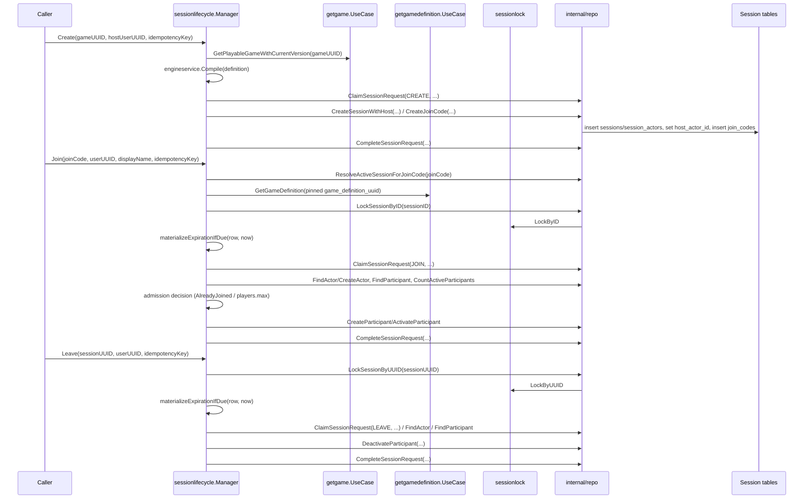

# Game - Flows

Status: CURRENT IMPLEMENTATION

## Retrieve Playable Game With Current Version

Implemented behavior:

- Missing games return no game.
- Non-playable visibility is rejected.
- Invalid visibility and invalid definition scripts are treated as broken game data.

Evidence:

- `game/game/usecases/getgame/service.go`
- `game/game/usecases/getgame/repo.go`
- `game/game/usecases/getgame/service_test.go`
- `game/game/usecases/getgame/repo_test.go`

## Create / Join / Leave Session

Implemented behavior:

- One `sessionlifecycle.Manager` workflow controller exposes `Create`/`Join`/`Leave` as its steps; it decides all business/lifecycle policy (admission, lazy lobby-expiration, idempotency-replay meaning) and owns transaction scope via a `transactor` abstraction. Its narrow `internal/repo` persistence layer reports facts and performs the mutations the Manager requests - it decides no policy itself.
- `Create` resolves/compiles/pins the Game's current playable Definition and never accepts an externally-supplied `engine.Program`; the host is never created as an active Participant.
- `Join` loads the Session's pinned Definition/Version directly (never the Game's current version) to enforce `players.max`, lazily materializes an expired lobby before rejecting, and rejects a *differently*-tokened Join while already an active Participant as `AlreadyJoined` (GAME-ADR-0021) rather than replaying or silently succeeding.
- `Leave` deactivates a Participant's slot while keeping the SessionActor durable and host authority unaffected.
- A deterministic business rejection discovered after an idempotency claim already succeeded (`AlreadyJoined`, lobby-full, actor-not-found) still commits that claim's completion (with the rejection as its outcome) in the same transaction, rather than rolling it back - so a same-token retry replays the rejection consistently. Lazy lobby-expiration materialization commits the same way.
- All three steps reuse the same per-Session DB-locking primitive (`sessionlock`, locked-row facts only) and the same `(user_uuid, operation, idempotency_key)` claim mechanism (`idempotency`, claim/replay mechanics only) - both invoked through `internal/repo`, never deciding policy themselves.

Evidence:

- `game/session/workflows/sessionlifecycle/` (`manager.go`, `step_create.go`, `step_join.go`, `step_leave.go`, `expiration.go`, `idempotency.go`, `internal/repo/`)
- `game/session/internal/sessionlock/`, `game/session/internal/idempotency/` (shared cross-cutting mechanics, consumed by `internal/repo`)
- `game/game/usecases/getgamedefinition/`

## Not Documented As Implemented

- Start, RuntimeTurn/engine execution, the Live Session Coordinator/WebSocket transport, disconnect/reconnect, and inactivity expiration (see `docs/ai/workspaces/active/session-runtime-v1/PLAN.md` Slices 2+).
