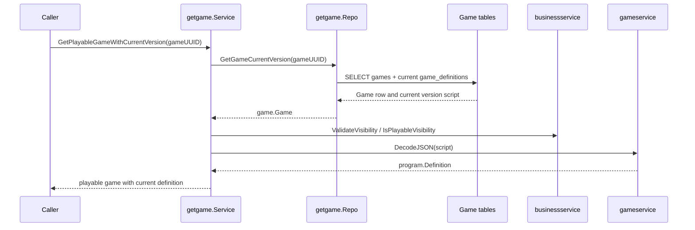
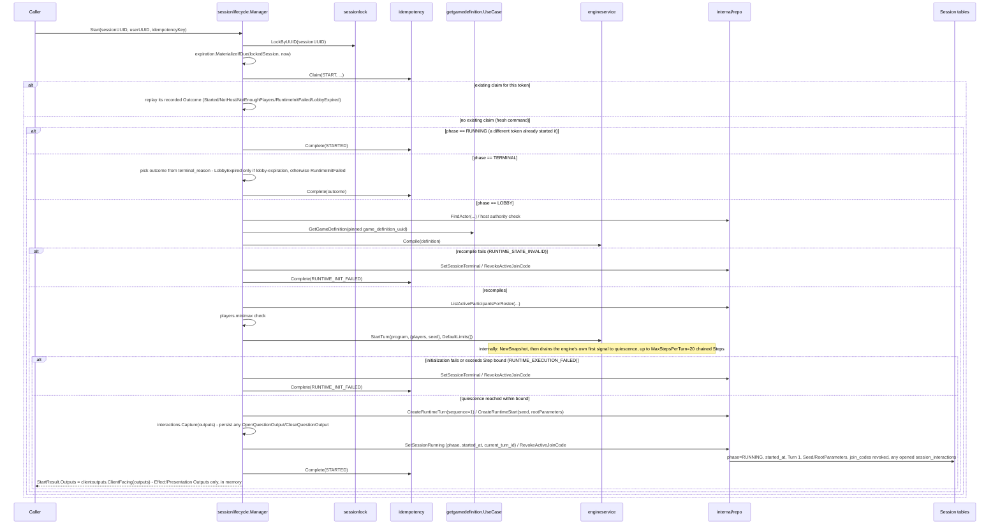
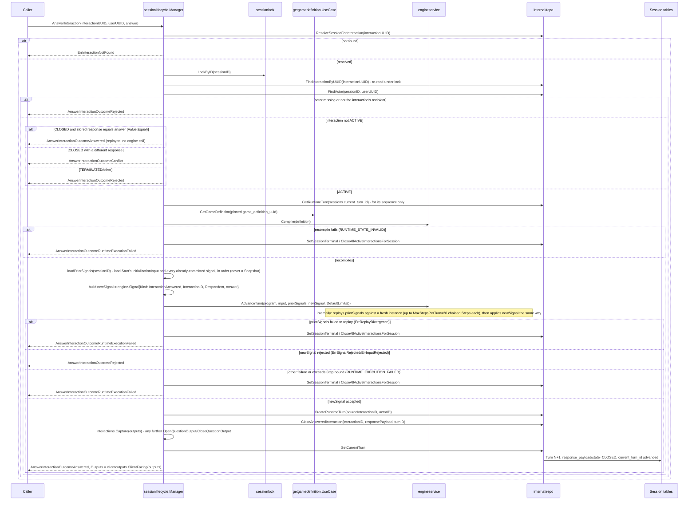

# Game - Flows

Status: CURRENT IMPLEMENTATION

## Retrieve Playable Game With Current Version



Implemented behavior:

- Missing games return no game.
- Non-playable visibility is rejected.
- Invalid visibility and invalid definition scripts are treated as broken game data.

Evidence:

- `game/management/usecases/getgame/service.go`
- `game/management/usecases/getgame/repo.go`
- `game/management/usecases/getgame/service_test.go`
- `game/management/usecases/getgame/repo_test.go`

## Create / Join / Leave Session


## Start Session (First RuntimeTurn)



Implemented behavior:

- `Start` is a step on the same `sessionlifecycle.Manager`, reusing the identical lock/lazy-expiration/idempotency pattern as Create/Join/Leave, plus the existing `pinnedGameReader` dependency Join already established (no new Game Management capability).
- RuntimeTurn Step-draining/bound execution (draining `Commit.InternalSignals` in FIFO order, the `engine.Limits.MaxStepsPerTurn = 20` bound) is entirely owned by `engineservice.StartTurn`/`AdvanceTurn` (`game/language/v1/engine/engineservice`), not by `sessionlifecycle` - this package never reconstructs an `engine.Snapshot` or implements any part of that mechanism itself (GAME-ADR-0027). `startSessionInTx` itself still owns Turn persistence and calls the shared `interactions.Capture` (see below) to record any interaction the Turn opened. No intra-Turn Step trace is persisted (`session_runtime_steps` was removed by WORK-0019/GAME-ADR-0024 - it had no independent live-correctness purpose and no replay-input role).
- Start's own deterministic initialization is durably persisted, atomically with Turn 1: `CreateRuntimeStart` writes `session_runtime_starts` (`seed` - `InitializationInput.Seed`'s `uint64` bit pattern reinterpreted as a signed `BIGINT` - and `root_parameters`, the `players` roster encoded through `engineservice.EncodeValue`). This is what makes a `RUNNING` Session's current state replay-reconstructable after process loss, per GAME-ADR-0024 - no full `engine.Snapshot` is ever persisted anywhere.
- `StartOutcomeStarted`/`LobbyExpired`/`NotHost`/`NotEnoughPlayers`/`RuntimeInitFailed` are all returned as `StartResult.Outcome` values alongside a `nil` error (GAME-ADR-0022), including the fatal `RuntimeInitFailed` case, which is recorded as the `START` idempotency claim's completed - and replayable - outcome exactly like any other decline.
- Two distinct fatal-path terminal reasons are materialized directly `LOBBY -> TERMINAL` with `started_at` left `NULL` and no `session_runtime_turns`/`session_runtime_starts` row written: `RUNTIME_STATE_INVALID` (the pinned Definition unexpectedly fails to recompile - a data-integrity anomaly, since it already compiled at Create) and `RUNTIME_EXECUTION_FAILED` (everything else - a `StartTurn` execution error, an outright rejection of Start's own initial signal chain, or exceeding the 20-Step bound).
- The `players` root roster is built from active Participants ordered by `joined_at` ascending (ties broken by internal actor id); each `engine.UserValue.ID` is the Participant's internal `session_actors.id`, never `Identity.UserUUID`.
- The idempotency claim is attempted before any phase-based decision, so a same-token retry always replays its own recorded outcome first, regardless of the Session's current phase; only a token with no existing claim (a genuinely fresh command) falls through to a phase-based decision. A concurrent Start that observes the Session already `RUNNING` (a different token already won the lock race) reports `StartOutcomeStarted` directly - already-true current state, not a lobby-expiration decline. A fresh command against an already-`TERMINAL` Session reports the outcome its actual `terminal_reason` explains - `StartOutcomeLobbyExpired` only for lobby expiration, `StartOutcomeRuntimeInitFailed` for a Session terminalized by an earlier Start's own fatal path - never unconditionally the former.
- The current-authoritative-Turn pointer is `sessions.current_turn_id`, not a separate `session_runtime_state` table (GAME-ADR-0023, refining GAME-ADR-0007) - every caller that needs it already holds the locked `sessions` row for per-Session serialization, so colocating it there is free; it is a logical, non-DB-enforced reference like every other reference in this schema.
- `interactions.Capture` (`internal/interactions/capture.go`) walks the Turn's flat `[]engine.Output` (as `StartTurn`/`AdvanceTurn` return it - no per-Step grouping exists for this package to care about) in order and persists each `OpenQuestionOutput` as a new `ACTIVE` `session_interactions` row (`kind`/`engine_interaction_id` read directly off the Output's own `Kind`/`InteractionID` fields - no compiled `engine.Program` lookup is needed to classify what was opened) and each `CloseQuestionOutput` as a Turn-produced closure of the matching `ACTIVE` row (matched by `engine_interaction_id`) - shared unchanged between Start's own first Turn and AnswerInteraction's Turn, so no Turn-producing path can silently skip persisting an opened interaction.
- `clientoutputs.ClientFacing` (`internal/clientoutputs/clientoutputs.go`) selects the same Turn's `EmitEffectOutput`/`ActivatePresentationOutput`/`UpdatePresentationOutput`/`RemovePresentationOutput` values, in the same relative order, and `StartResult.Outputs` returns them directly - additive data only, computed fresh every call, never persisted (a future resync recomputes current Presentation state from the current Snapshot on demand instead of reading anything back). No caller outside this package consumes `Outputs` yet.
- Behavior shared by two or more of this workflow's steps (lazy-expiration materialization, interaction capture, client-facing Output filtering, replay reconstruction) lives under `sessionlifecycle`'s own `internal/<mechanism-name>/` subpackages (`internal/expiration/`, `internal/interactions/`, `internal/clientoutputs/`, `internal/replay/`), sibling to `internal/repo/` - never inline in a `step_*.go` file, and never elevated to the domain-wide `game/session/internal/`.

Evidence:

- `game/session/workflows/sessionlifecycle/step_start.go`, `internal/replay/replay.go`, `internal/interactions/capture.go`, `internal/clientoutputs/clientoutputs.go`, `internal/expiration/expiration.go`, `game/language/v1/engine/engineservice/runtime.go` (`StartTurn`/`AdvanceTurn`), `internal/repo/runtime_turn.go`, `internal/repo/runtime_start.go`, `internal/repo/interaction.go`, `internal/repo/session.go`'s `SetSessionRunning`, `internal/repo/participant.go`'s `ListActiveParticipantsForRoster`
- `game/session/internal/storage/migrations/20260919000000_session_runtime_turns.go` (no Snapshot column - GAME-ADR-0024/WORK-0019); `sessions.current_turn_id` is added by `game/session/internal/storage/migrations/20260908000001_sessions.go`'s successor migration (see WORK-0003's revision record); `session_interactions` by `20260919000003_session_interactions.go` (identity migrated from `engine_path`/`engine_slot` to `engine_interaction_id` by `20260924000000_session_interactions_engine_interaction_id.go`); `session_runtime_starts` and `session_cause_events`/`session_runtime_turns.source_cause_event_id` by `game/session/internal/storage/migrations/2026092200000{0,1}_*.go`

## Answer Interaction (RUNNING-Phase RuntimeTurn)



Implemented behavior:

- `AnswerInteraction` is a step on the same `sessionlifecycle.Manager`, not a separate workflow package - RUNNING-phase execution stays alongside LOBBY admission on one Manager. There is no `session_requests` idempotency record for this operation: the interaction row's own persisted `state`/`response_payload` is the natural dedup identity - a retried, semantically equivalent response replays `Answered` without a second engine effect; a conflicting different response against an already-resolved interaction is rejected as `Conflict`, also without reaching the engine.
- RUNNING-phase per-Session serialization reuses `sessionlock.LockByID` unchanged (GAME-ADR-0018) - the same primitive Create/Join/Leave/Start already use for LOBBY. Execution always reloads `sessions.current_turn_id` and reconstructs current authoritative state by replay after acquiring the lock, never trusting a pre-lock read or a persisted Snapshot (GAME-ADR-0024, WORK-0019) - `GetRuntimeTurn` is used only for the current Turn's `sequence`, to compute the next one.
- Respondent authorization (the caller's resolved `SessionActorID` must equal the interaction's own `session_actor_id`) is checked directly against the persisted row before ever constructing an `engine.Signal`, the same rejection the engine would itself produce for an unauthorized `Respondent` - so an unauthorized caller never reaches the engine at all.
- `engine.Signal` is constructed as `SignalKindInteractionAnswered` directly, with `InteractionID` set from the interaction's own persisted `engine_interaction_id` - the engine itself resolves which underlying slot (ordinary or keyed) and occurrence Key that `InteractionID` addresses, and whether it behaves as a Question or an Ask Group, so no `kind`-based branching is needed to pick a `SignalKind` any more.
- The engine clears an accepted answer's own question slot internally, before the transition's own authored operations run, and produces no `CloseQuestionOutput` for that closure - `interactions.Capture` only ever catches an authored `CloseQuestionOperation` on some *other* slot. The specifically answered interaction is instead closed directly by its already-known id (`CloseAnsweredInteraction`), before `interactions.Capture` runs, in the same transaction as the new RuntimeTurn - so an authored transition that reopens the exact same `InteractionID` it just answered never collides with the not-yet-closed old row.
- A rejection of `newSignal` itself (`ErrSignalRejected`/`ErrInputRejected`) is an ordinary declined outcome: no RuntimeTurn, no Snapshot mutation, Session stays `RUNNING`. A failure to replay `priorSignals` (`ErrReplayDivergence`) is structurally distinct and always terminalizes the Session, the same as any other execution failure - every element of `priorSignals` already succeeded once, so failing to reproduce it is a data-integrity condition, never an ordinary decline. Any other failure, including exceeding the Step bound, terminalizes the Session `RUNTIME_EXECUTION_FAILED`/`RUNTIME_STATE_INVALID`, atomically closing every currently-`ACTIVE` `session_interactions` row for the Session in the same transaction (`closed_by_turn_id NULL`, `closure_reason = SESSION_TERMINATED`).
- `session_runtime_turns.source_interaction_id`/`actor_id` are populated for AnswerInteraction's own caused Turn (never by Start's).
- `AnswerInteractionResult.Outputs` carries the same accepted Turn's `clientoutputs.ClientFacing(outputs)` (Effect/Presentation Outputs only, in commit order) whenever `Outcome` is `Answered` and this call actually executed the engine; every declined/replayed/conflicting outcome leaves it empty, since no new RuntimeTurn committed.
- Current authoritative Runtime state is never loaded from a persisted Snapshot - `engineservice.AdvanceTurn` deterministically rebuilds it internally, from Start's `InitializationInput` and every committed `session_runtime_turns` row `loadPriorSignals` (`replay.go`) supplies it, in sequence order (each later Turn's signal reconstructed by dispatching its own `source_kind` to the `engine.Signal` its durable cause implies - today, only `INTERACTION_RESPONSE` is dispatched this way; a future cause extends `loadReplaySignal` with its own case once its own owning WORK gives it a durable representation to reconstruct from). `sessionlifecycle` holds no cache of any kind and never constructs an `engine.Snapshot` itself (GAME-ADR-0027): every call's replay happens inside `engineservice`, from scratch, so a process-loss recovery reconstructs the exact same current state purely from durable state.

Evidence:

- `game/session/workflows/sessionlifecycle/step_answer_interaction.go`, `internal/replay/replay.go`, `internal/interactions/capture.go`, `internal/clientoutputs/clientoutputs.go`, `game/language/v1/engine/engineservice/runtime.go` (`AdvanceTurn`), `internal/repo/interaction.go`, `internal/repo/runtime_start.go`
- `game/session/internal/storage/migrations/20260919000003_session_interactions.go`, `2026092200000{0,1}_*.go` (`session_runtime_starts`/`session_cause_events`), `20260924000000_session_interactions_engine_interaction_id.go` (`engine_interaction_id` identity)
- `game/session/workflows/sessionlifecycle/replay_integration_test.go` (`TestReconstructCurrentSnapshot_Integration` - proves replay reconstruction matches the state produced by the original live execution, checked against a live random draw and literal answer values never decoded from the rows replay itself reads, and is reproducible from two independent processes), `replay_fixture_test.go` (`TestReplayObservableDefinitionFixture` - a no-database sanity check of the fixture the integration test depends on)

Implemented behavior:

- One `sessionlifecycle.Manager` workflow controller exposes `Create`/`Join`/`Leave` as its steps; it decides all business/lifecycle policy (admission, lazy lobby-expiration, idempotency-replay meaning) and owns transaction scope by calling `utils.RunInDBTransaction` directly (Manager itself satisfies its `DBServicer` contract) - it holds no separate injected `transactor` dependency. Its narrow `internal/repo` persistence layer reports facts and performs the mutations the Manager requests - it decides no policy itself. Each step calls the shared `sessionlock`/`idempotency` mechanism packages directly rather than through repository forwarding methods.
- `Create` resolves/compiles/pins the Game's current playable Definition and never accepts an externally-supplied `engine.Program`; the host is never created as an active Participant.
- `Join` loads the Session's pinned Definition/Version directly (never the Game's current version) to enforce `players.max`, lazily materializes an expired lobby before rejecting, and rejects a *differently*-tokened Join while already an active Participant as `AlreadyJoined` (GAME-ADR-0021) rather than replaying or silently succeeding. `JOINED`/`LOBBY_EXPIRED`/`LOBBY_FULL`/`ALREADY_JOINED` are all returned as `JoinResult.Outcome` values alongside a `nil` error, never as a Go `error` (GAME-ADR-0022).
- `Leave` deactivates a Participant's slot while keeping the SessionActor durable and host authority unaffected; its own declines (`NOT_IN_LOBBY`, `ACTOR_NOT_FOUND`) are likewise `LeaveResult.Outcome` values, not errors.
- A deterministic business decline discovered after an idempotency claim already succeeded (`AlreadyJoined`, lobby-full, actor-not-found) still commits that claim's completion (with the decline as its outcome) in the same transaction, through the transaction callback's ordinary successful return path - so a same-token retry replays the decline consistently. Lazy lobby-expiration materialization commits the same way. Only an invalid command/protocol contract (missing idempotency token, a same-token conflicting request) or an infrastructure/invariant failure is a Go `error`.
- All three steps reuse the same per-Session DB-locking primitive (`sessionlock`, locked-row facts only) and the same `(user_uuid, operation, idempotency_key)` claim mechanism (`idempotency`, claim/replay mechanics only). The claim mechanism's PostgreSQL implementation is a single non-error `INSERT ... ON CONFLICT DO UPDATE ... RETURNING` upsert (distinguishing a fresh claim from an existing one via the `xmax` system column) rather than a provoke-then-recover unique-violation catch, so a losing claim attempt's transaction is never left aborted.

Evidence:

- `game/session/workflows/sessionlifecycle/` (`manager.go`, `step_create.go`, `step_join.go`, `step_leave.go`, `internal/expiration/`, `internal/repo/`)
- `game/session/internal/sessionlock/`, `game/session/internal/idempotency/` (shared cross-cutting mechanics, called directly by the Manager's steps)
- `game/management/usecases/getgamedefinition/`

## Live Transport: Join / AnswerInteraction Fan-Out (WebSocket)

**Superseded 2026-09-21, preserved as historical record (WORK-0005's Blocker 11)**: everything below this note describes a stateful `play` Coordinator and `play/sessionruntime` bridge that were built, then removed - `play` no longer exists in the repository. `api`'s HTTP/WebSocket transport (route registration, connection upgrade, read/write pumps) still exists and still works exactly as described below, but currently calls no domain package: `Create` always answers `501`, and every WS message always answers `ERROR`. The Coordinator/fan-out logic below was found to be built on top of Session Runtime output-handling that was both incomplete and already known to change (see the section above on `sessionlifecycle.Manager`'s Output handling) - rather than keep extending it, it was removed until Session Runtime's own engine-Output handling is complete, at which point a real Coordinator is rebuilt on top of it once, correctly. Do not implement against this section - it does not describe current behavior.

A real client connects over WebSocket and exercises `Join`/`AnswerInteraction` live, with an interaction Session Runtime opens delivered back to it and its answer delivered back to Session Runtime (WORK-0005). `Create` stays ordinary HTTP request/response - it happens before any Participant or connection exists. `Join` does not: it is the WebSocket handshake itself, so a client can never end up an active Participant without also being a bound live connection (or vice versa) - see this file's own history further down for why.

`Start` does not ride this connection. It is a host-only operation, and this connection is only obtainable by joining as a Participant - exposing `Start` here would force a host through `Join` merely to get a connection to send it. Until a connection kind exists that a host can obtain without joining (`docs/projects/active/session-runtime-v1/works/WORK-0020-role-aware-live-connections.md`), progressing a Session to `RUNNING` (so there is an interaction for the sequence below to open) happens by calling `sessionlifecycle.Manager.Start`/`play.Coordinator.Start` directly at the Go-API level, outside this diagram.

```
Client                api (transport)        play.Coordinator      play/sessionruntime      sessionlifecycle.Manager      Postgres
  |--POST /sessions------->|                        |                      |                         |                       |
  |                        |---Create-------------->|---Create------------>|---Create--------------->|--commit-------------->|
  |<--session_uuid,--------|<-----------------------|<---------------------|<------------------------|                       |
  |    join_code           |                        |                      |                         |                       |
  |--GET /ws?join_code&user_uuid&display_name&idempotency_key---->|         |                         |                       |
  |                        |---Join---------------->|---Join--------------->|---Join------------------>|--commit-------------->|
  |                        |          (only if JOINED/ALREADY_JOINED: upgrade, then)                   |                       |
  |                        |---Bind(session,user,conn)->[registered]        |                         |                       |
  |<--(101 upgrade)---------|                        |                      |                         |                       |
  |<--JOIN_RESULT-----------|                        |                      |                         |                       |
  .   (Start happens here, at the Go-API level, directly against Coordinator/Manager - not a wire message)   .
  |                        |                        |<--Events[Opened]------|<------------------------|                       |
  |<--INTERACTION_OPENED---|<--fan-out Deliver()----|                      |                         |                       |
  |--{"type":"ANSWER_INTERACTION",answer}-->|--AnswerInteraction-->|--AnswerInteraction-->|--AnswerInteraction (Manager)->|--commit RuntimeTurn-->|
  |                        |                        |                      |---read session_interactions WHERE closed_by_turn_id=current_turn_id (post-commit)--->|
  |                        |                        |<--Events[Closed]------|<------------------------|                       |
  |<--ANSWER_RESULT--------|<--fan-out Deliver()----|                      |                         |                       |
  |<--INTERACTION_CLOSED---|                        |                      |                         |                       |
```

A decline (`LOBBY_EXPIRED`/`LOBBY_FULL`) or an error never upgrades at all - the client receives a plain HTTP response instead of the sequence above.

Implemented behavior:

- `api` is organized as one route group per workflow (`api/<workflow>/`, e.g. `api/session/`) composed by a domain-agnostic `api.Server`/`api.NewServer(db *gorm.DB)` (`api/server.go`), rather than one flat handler file - `api` is the single transport/application edge for the whole system, so it is expected to keep accumulating route groups as more workflows are exposed; `api.NewServer` constructs each group's own dependency itself from `db` rather than receiving a pre-built group. `api/session` owns the HTTP upgrade handshake and one read-pump/write-pump goroutine pair per connection (`api/session/ws.go`); all outbound writes for a connection - both fanned-out `play.Event`s and that same connection's own command results/errors - go through one buffered channel drained by that connection's single write-pump goroutine, since a WebSocket connection supports exactly one concurrent writer.
- `Join` is not a separate HTTP call: `GET /ws` calls `Join` first and only upgrades/binds the connection when the outcome means the caller is now an active Participant (`JOINED`, or the idempotent-replay-shaped `ALREADY_JOINED` a reconnecting client's fresh idempotency token produces). A client that could call HTTP Join without also separately connecting would be a persisted Participant the Coordinator never bound anything for, silently missing whatever an opened interaction delivers - collapsing the two into one client-facing operation removes that failure mode entirely, at the cost of `play.Coordinator`'s `Join` and `Bind` still being two separate Go calls internally (`Bind` needs an actual live socket, which only exists once the HTTP connection has already been upgraded, which only happens once `Join` has already returned successfully) - `api/session`'s own handler sequences them, not the client.
- `Start` is deliberately not a wire message: this connection is only obtainable by joining as a Participant, but `Start` is a host-only operation, so exposing it here would force a host through `Join` merely to get a connection to send it. It is reachable only at the Go-API level today (`docs/projects/active/session-runtime-v1/works/WORK-0005-thin-live-coordinator.md`'s Blocker 10), until `docs/projects/active/session-runtime-v1/works/WORK-0020-role-aware-live-connections.md` gives a host a connection that does not require joining.
- `play` (top-level package, sibling of `game`/`api`/`identity`) is the Live Session Coordinator: an in-process, per-Session registry of bound connections (`Coordinator.Bind`/`Coordinator.Deliver`), never touching `game` directly. It declares the `SessionRuntime` port it depends on; nothing `play` exports references a `game` type (verified by `go list -deps ./play` containing no `game/...` package, and `go list -deps ./game/...` containing neither `play` nor `api`). `Coordinator.Start`/`AnswerInteraction` return the resulting Events instead of delivering them internally, so a route group can enqueue its own direct reply before calling `Coordinator.Deliver` - otherwise a fanned-out Event could reach a client before the direct reply to the command that caused it, when that client is also one of the Event's recipients.
- `play/sessionruntime` implements that port by calling the existing, unmodified `sessionlifecycle.Manager`. Since `Manager` never returns `engine.Output` values to its caller (and this slice does not change that), `play/sessionruntime` reads back the committed `RuntimeTurn`'s `session_interactions` rows (`opened_by_turn_id`/`closed_by_turn_id` = `sessions.current_turn_id`, GAME-ADR-0023) after `Manager`'s own call has already durably committed and reported success, and translates them into `play.Event`s - the durable record `interaction_capture.go` already writes for exactly `OpenQuestionOutput`/`CloseQuestionOutput`, never any other `Output` variant (Blocker 4's resolved scope). The translation never leaks `engine_path`/`Slot`/`SessionActorID`: a recipient is resolved through `session_actors.user_uuid` to the caller-facing `UserUUID` the client itself supplied.
- Delivery is best-effort and strictly post-commit (GAME-ADR-0020): `Coordinator` never sees an `Event` until `SessionRuntime`'s call has already returned success, and a `Conn.Deliver` failure is only ever logged - it never reopens, retries, or reinterprets the already-committed Session state. A recipient with no bound connection simply receives nothing.
- `(SessionUUID, UserUUID)` connection binding extends Slice 1's already-established trusted-caller stance (no Identity implementation exists yet): the client supplies `UserUUID` directly as a `GET /ws` query parameter; real credential verification is deferred to a future Identity/Auth slice.
- The client's submitted answer rides the WebSocket as the engine's own `engineservice.EncodeValue` wire format - the same codec `session_interactions.response_payload` already persists through, reused rather than inventing a second value encoding for this thin slice.
- `api/session` is the one entry point that starts a request log (`logging.Start`/`defer logging.FinishRequestLog`): once per HTTP request, once per WebSocket connect/disconnect event, and once per individual inbound WS message (a long-lived connection is many logged exchanges, not one). `play.Coordinator` and `play/sessionruntime.SessionRuntime` add their own `logging.Step` nested under whichever entry point called them, the same way `sessionlifecycle.Manager` already did - so one flushed structured log line covers the full path from HTTP/WS entry point down through Manager (`docs/engineering/standards/logging.md`).

Evidence:

- `play/play.go`, `play/coordinator.go`, `play/README.md`
- `play/sessionruntime/sessionruntime.go`, `play/sessionruntime/query.go`, `play/sessionruntime/wiring.go`
- `api/server.go`, `api/session/handler.go`, `api/session/http.go`, `api/session/ws.go`, `api/session/wire.go`, `api/internal/httpx/json.go`
- `docs/work/active/WORK-0005-thin-live-coordinator.md`

## Not Documented As Implemented

- Session Runtime timer obligations, the `session_runtime_failures` diagnostic entity, disconnect/reconnect, resync, and inactivity expiration (see `docs/ai/workspaces/active/session-runtime-v1/PLAN.md` Slices 5-8). The Coordinator/WebSocket transport above is deliberately thin: no disconnect grace/debounce, no semantic presence, no timer scheduling, no reconnect/resync - a client that disconnects simply stops receiving further messages until Slice 7 exists.
