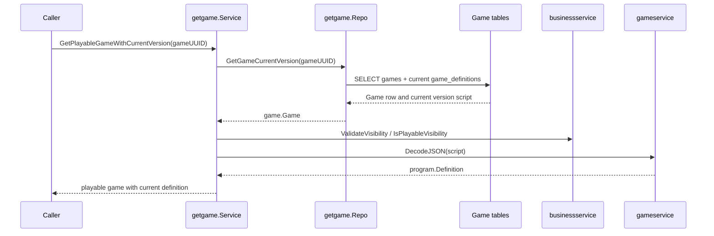

# Game - Flows

Status: CURRENT IMPLEMENTATION

## Retrieve Playable Game With Current Version



Implemented behavior:

- Missing games return no game.
- Non-playable visibility is rejected.
- Invalid visibility and invalid definition scripts are treated as broken game data.

Evidence:

- `game/game/usecases/getgame/service.go`
- `game/game/usecases/getgame/repo.go`
- `game/game/usecases/getgame/service_test.go`
- `game/game/usecases/getgame/repo_test.go`

## Create / Join / Leave Session

```mermaid
sequenceDiagram
    participant Caller
    participant Create as createsession.UseCase
    participant Join as joinsession.UseCase
    participant Leave as leavesession.UseCase
    participant GetGame as getgame.UseCase
    participant GetDef as getgamedefinition.UseCase
    participant Lock as sessionlock
    participant Idem as idempotency
    participant DB as Session tables

    Caller->>Create: CreateSession(gameUUID, hostUserUUID, idempotencyKey)
    Create->>GetGame: GetPlayableGameWithCurrentVersion(gameUUID)
    Create->>Create: engineservice.Compile(definition)
    Create->>Idem: Claim(CREATE, ...)
    Create->>DB: insert sessions/session_actors, set host_actor_id, insert join_codes
    Create->>Idem: Complete(...)

    Caller->>Join: JoinSession(joinCode, userUUID, displayName, idempotencyKey)
    Join->>DB: resolve active JoinCode -> session_id, game_definition_uuid
    Join->>GetDef: GetGameDefinition(pinned game_definition_uuid)
    Join->>Lock: LockByID / MaterializeExpirationIfDue
    Join->>Idem: Claim(JOIN, ...)
    Join->>DB: find-or-create session_actor, activate/reactivate participant
    Join->>Idem: Complete(...)

    Caller->>Leave: LeaveSession(sessionUUID, userUUID, idempotencyKey)
    Leave->>Lock: LockByUUID / MaterializeExpirationIfDue
    Leave->>Idem: Claim(LEAVE, ...)
    Leave->>DB: deactivate participant (session_actor retained, host_actor_id untouched)
    Leave->>Idem: Complete(...)
```

Implemented behavior:

- CreateSession resolves/compiles/pins the Game's current playable Definition and never accepts an externally-supplied `engine.Program`; the host is never created as an active Participant.
- JoinSession loads the Session's pinned Definition/Version directly (never the Game's current version) to enforce `players.max`, and lazily materializes an expired lobby before rejecting.
- LeaveSession deactivates a Participant's slot while keeping the SessionActor durable and host authority unaffected.
- All three mutations reuse the same per-Session DB-locking primitive (`sessionlock`) and the same `(user_uuid, operation, idempotency_key)` claim mechanism (`idempotency`).

Evidence:

- `game/session/usecases/createsession/`, `game/session/usecases/joinsession/`, `game/session/usecases/leavesession/`
- `game/session/internal/sessionlock/`, `game/session/internal/idempotency/`, `game/session/internal/actors/`
- `game/game/usecases/getgamedefinition/`

## Not Documented As Implemented

- Start, RuntimeTurn/engine execution, the Live Session Coordinator/WebSocket transport, disconnect/reconnect, and inactivity expiration (see `docs/ai/workspaces/active/session-runtime-v1/PLAN.md` Slices 2+).
