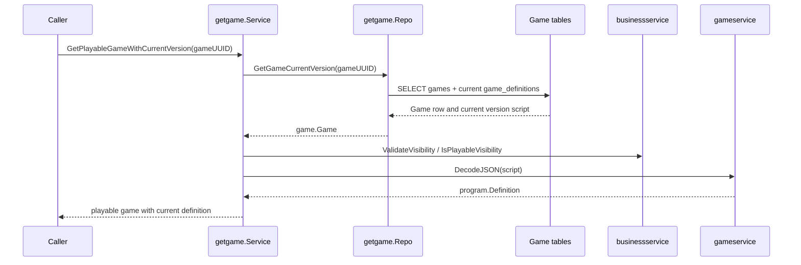
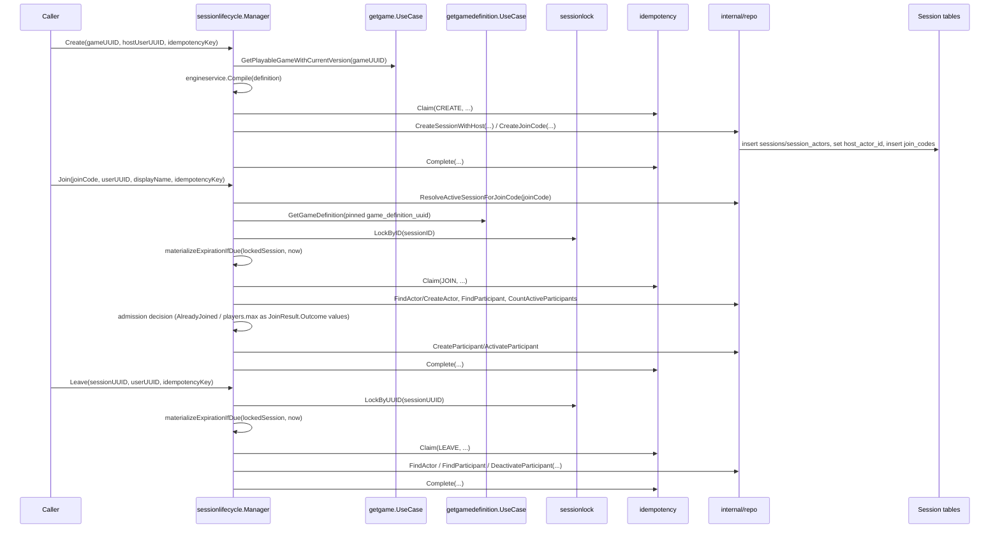

# Game - Flows

Status: CURRENT IMPLEMENTATION

## Retrieve Playable Game With Current Version

Implemented behavior:

- Missing games return no game.
- Non-playable visibility is rejected.
- Invalid visibility and invalid definition scripts are treated as broken game data.

Evidence:

- `game/game/usecases/getgame/service.go`
- `game/game/usecases/getgame/repo.go`
- `game/game/usecases/getgame/service_test.go`
- `game/game/usecases/getgame/repo_test.go`

## Create / Join / Leave Session

Implemented behavior:

- One `sessionlifecycle.Manager` workflow controller exposes `Create`/`Join`/`Leave` as its steps; it decides all business/lifecycle policy (admission, lazy lobby-expiration, idempotency-replay meaning) and owns transaction scope by calling `utils.RunInDBTransaction` directly (Manager itself satisfies its `DBServicer` contract) - it holds no separate injected `transactor` dependency. Its narrow `internal/repo` persistence layer reports facts and performs the mutations the Manager requests - it decides no policy itself. Each step calls the shared `sessionlock`/`idempotency` mechanism packages directly rather than through repository forwarding methods.
- `Create` resolves/compiles/pins the Game's current playable Definition and never accepts an externally-supplied `engine.Program`; the host is never created as an active Participant.
- `Join` loads the Session's pinned Definition/Version directly (never the Game's current version) to enforce `players.max`, lazily materializes an expired lobby before rejecting, and rejects a *differently*-tokened Join while already an active Participant as `AlreadyJoined` (GAME-ADR-0021) rather than replaying or silently succeeding. `JOINED`/`LOBBY_EXPIRED`/`LOBBY_FULL`/`ALREADY_JOINED` are all returned as `JoinResult.Outcome` values alongside a `nil` error, never as a Go `error` (GAME-ADR-0022).
- `Leave` deactivates a Participant's slot while keeping the SessionActor durable and host authority unaffected; its own declines (`NOT_IN_LOBBY`, `ACTOR_NOT_FOUND`) are likewise `LeaveResult.Outcome` values, not errors.
- A deterministic business decline discovered after an idempotency claim already succeeded (`AlreadyJoined`, lobby-full, actor-not-found) still commits that claim's completion (with the decline as its outcome) in the same transaction, through the transaction callback's ordinary successful return path - so a same-token retry replays the decline consistently. Lazy lobby-expiration materialization commits the same way. Only an invalid command/protocol contract (missing idempotency token, a same-token conflicting request) or an infrastructure/invariant failure is a Go `error`.
- All three steps reuse the same per-Session DB-locking primitive (`sessionlock`, locked-row facts only) and the same `(user_uuid, operation, idempotency_key)` claim mechanism (`idempotency`, claim/replay mechanics only). The claim mechanism's PostgreSQL implementation is a single non-error `INSERT ... ON CONFLICT DO UPDATE ... RETURNING` upsert (distinguishing a fresh claim from an existing one via the `xmax` system column) rather than a provoke-then-recover unique-violation catch, so a losing claim attempt's transaction is never left aborted.

Evidence:

- `game/session/workflows/sessionlifecycle/` (`manager.go`, `step_create.go`, `step_join.go`, `step_leave.go`, `expiration.go`, `payload.go`, `internal/repo/`)
- `game/session/internal/sessionlock/`, `game/session/internal/idempotency/` (shared cross-cutting mechanics, called directly by the Manager's steps)
- `game/game/usecases/getgamedefinition/`

## Not Documented As Implemented

- Start, RuntimeTurn/engine execution, the Live Session Coordinator/WebSocket transport, disconnect/reconnect, and inactivity expiration (see `docs/ai/workspaces/active/session-runtime-v1/PLAN.md` Slices 2+).
