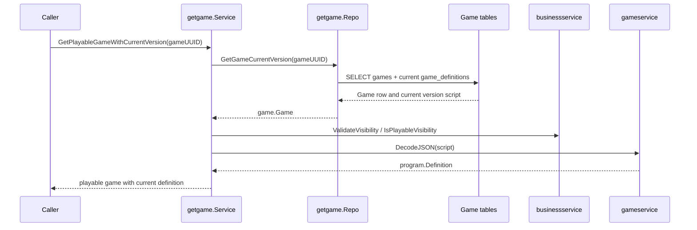
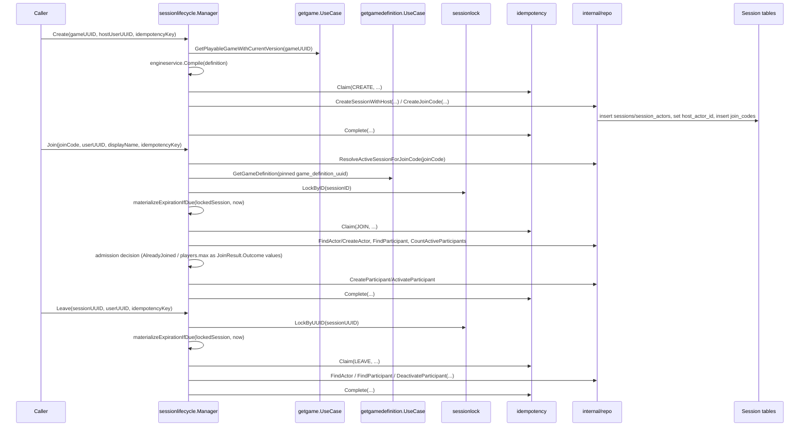
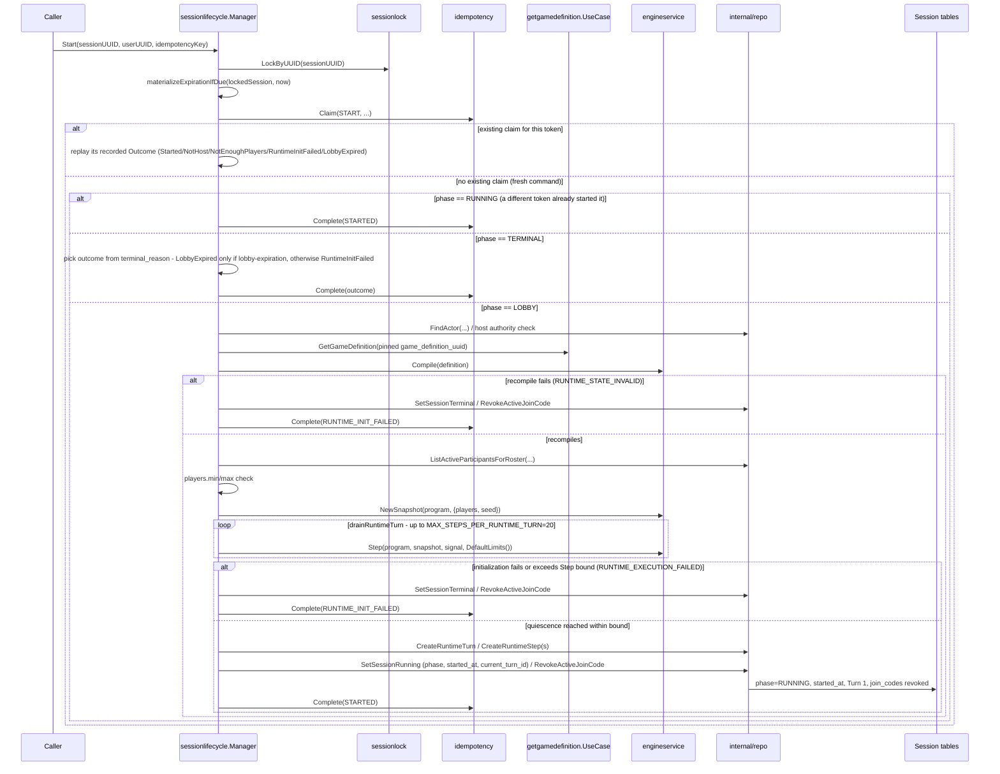

# Game - Flows

Status: CURRENT IMPLEMENTATION

## Retrieve Playable Game With Current Version

Implemented behavior:

- Missing games return no game.
- Non-playable visibility is rejected.
- Invalid visibility and invalid definition scripts are treated as broken game data.

Evidence:

- `game/management/usecases/getgame/service.go`
- `game/management/usecases/getgame/repo.go`
- `game/management/usecases/getgame/service_test.go`
- `game/management/usecases/getgame/repo_test.go`

## Create / Join / Leave Session

## Start Session (First RuntimeTurn)

Implemented behavior:

- `Start` is a fourth step on the same `sessionlifecycle.Manager`, reusing the identical lock/lazy-expiration/idempotency pattern as Create/Join/Leave, plus the existing `pinnedGameReader` dependency Join already established (no new Game Management capability).
- Start's own RuntimeTurn execution logic (Step-draining `Commit.InternalSignals` in FIFO order, the `MAX_STEPS_PER_RUNTIME_TURN = 20` bound, and Turn/Step/State persistence) lives inline inside `step_start.go` (`drainRuntimeTurn` and `startSessionInTx`) rather than a separate shared package - a deliberate human decision (2026-09-19, see `docs/work/active/WORK-0003-session-start-first-runtimeturn.md`) that this is workflow execution logic no other current use case calls independently. `drainRuntimeTurn` is a pure function over `engine`/`engineservice` with no persistence dependency, unit-tested directly without a real database connection.
- `StartOutcomeStarted`/`LobbyExpired`/`NotHost`/`NotEnoughPlayers`/`RuntimeInitFailed` are all returned as `StartResult.Outcome` values alongside a `nil` error (GAME-ADR-0022), including the fatal `RuntimeInitFailed` case, which is recorded as the `START` idempotency claim's completed - and replayable - outcome exactly like any other decline.
- Two distinct fatal-path terminal reasons are materialized directly `LOBBY -> TERMINAL` with `started_at` left `NULL` and no Turn/Step/State row written: `RUNTIME_STATE_INVALID` (the pinned Definition unexpectedly fails to recompile - a data-integrity anomaly, since it already compiled at Create) and `RUNTIME_EXECUTION_FAILED` (everything else - `NewSnapshot`/`Step` execution errors, an outright rejection of Start's own initial signal chain, or exceeding the 20-Step bound).
- The `players` root roster is built from active Participants ordered by `joined_at` ascending (ties broken by internal actor id); each `engine.UserValue.ID` is the Participant's internal `session_actors.id`, never `Identity.UserUUID`.
- The idempotency claim is attempted before any phase-based decision, so a same-token retry always replays its own recorded outcome first, regardless of the Session's current phase; only a token with no existing claim (a genuinely fresh command) falls through to a phase-based decision. A concurrent Start that observes the Session already `RUNNING` (a different token already won the lock race) reports `StartOutcomeStarted` directly - already-true current state, not a lobby-expiration decline. A fresh command against an already-`TERMINAL` Session reports the outcome its actual `terminal_reason` explains - `StartOutcomeLobbyExpired` only for lobby expiration, `StartOutcomeRuntimeInitFailed` for a Session terminalized by an earlier Start's own fatal path - never unconditionally the former.
- The current-authoritative-Turn pointer is `sessions.current_turn_id`, not a separate `session_runtime_state` table (GAME-ADR-0023, refining GAME-ADR-0007) - every caller that needs it already holds the locked `sessions` row for per-Session serialization, so colocating it there is free; it is a logical, non-DB-enforced reference like every other reference in this schema.

Evidence:

- `game/session/workflows/sessionlifecycle/step_start.go`, `internal/repo/runtime_turn.go`, `internal/repo/session.go`'s `SetSessionRunning`, `internal/repo/participant.go`'s `ListActiveParticipantsForRoster`
- `game/session/internal/storage/migrations/2026091900000{0,1}_*.go` (`session_runtime_turns`/`session_runtime_steps`); `sessions.current_turn_id` is added by `game/session/internal/storage/migrations/20260908000001_sessions.go`'s successor migration (see WORK-0003's revision record)

Implemented behavior:

- One `sessionlifecycle.Manager` workflow controller exposes `Create`/`Join`/`Leave` as its steps; it decides all business/lifecycle policy (admission, lazy lobby-expiration, idempotency-replay meaning) and owns transaction scope by calling `utils.RunInDBTransaction` directly (Manager itself satisfies its `DBServicer` contract) - it holds no separate injected `transactor` dependency. Its narrow `internal/repo` persistence layer reports facts and performs the mutations the Manager requests - it decides no policy itself. Each step calls the shared `sessionlock`/`idempotency` mechanism packages directly rather than through repository forwarding methods.
- `Create` resolves/compiles/pins the Game's current playable Definition and never accepts an externally-supplied `engine.Program`; the host is never created as an active Participant.
- `Join` loads the Session's pinned Definition/Version directly (never the Game's current version) to enforce `players.max`, lazily materializes an expired lobby before rejecting, and rejects a *differently*-tokened Join while already an active Participant as `AlreadyJoined` (GAME-ADR-0021) rather than replaying or silently succeeding. `JOINED`/`LOBBY_EXPIRED`/`LOBBY_FULL`/`ALREADY_JOINED` are all returned as `JoinResult.Outcome` values alongside a `nil` error, never as a Go `error` (GAME-ADR-0022).
- `Leave` deactivates a Participant's slot while keeping the SessionActor durable and host authority unaffected; its own declines (`NOT_IN_LOBBY`, `ACTOR_NOT_FOUND`) are likewise `LeaveResult.Outcome` values, not errors.
- A deterministic business decline discovered after an idempotency claim already succeeded (`AlreadyJoined`, lobby-full, actor-not-found) still commits that claim's completion (with the decline as its outcome) in the same transaction, through the transaction callback's ordinary successful return path - so a same-token retry replays the decline consistently. Lazy lobby-expiration materialization commits the same way. Only an invalid command/protocol contract (missing idempotency token, a same-token conflicting request) or an infrastructure/invariant failure is a Go `error`.
- All three steps reuse the same per-Session DB-locking primitive (`sessionlock`, locked-row facts only) and the same `(user_uuid, operation, idempotency_key)` claim mechanism (`idempotency`, claim/replay mechanics only). The claim mechanism's PostgreSQL implementation is a single non-error `INSERT ... ON CONFLICT DO UPDATE ... RETURNING` upsert (distinguishing a fresh claim from an existing one via the `xmax` system column) rather than a provoke-then-recover unique-violation catch, so a losing claim attempt's transaction is never left aborted.

Evidence:

- `game/session/workflows/sessionlifecycle/` (`manager.go`, `step_create.go`, `step_join.go`, `step_leave.go`, `expiration.go`, `payload.go`, `internal/repo/`)
- `game/session/internal/sessionlock/`, `game/session/internal/idempotency/` (shared cross-cutting mechanics, called directly by the Manager's steps)
- `game/management/usecases/getgamedefinition/`

## Not Documented As Implemented

- Interaction response processing, the Live Session Coordinator/WebSocket transport, timer obligations, the `session_runtime_failures` diagnostic entity, disconnect/reconnect, and inactivity expiration (see `docs/ai/workspaces/active/session-runtime-v1/PLAN.md` Slices 3+).
