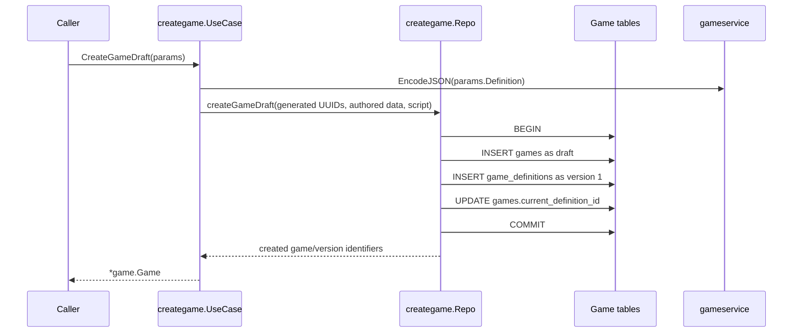
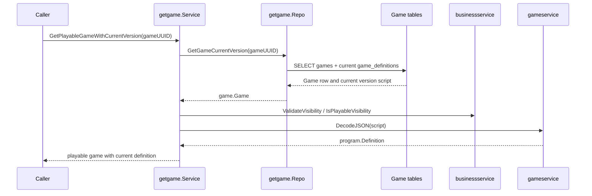

# Game - Flows

Status: CURRENT IMPLEMENTATION

## Create Draft Game With Initial Definition

Implemented behavior:

- Game and initial definition creation is atomic.
- The created game is stored with `draft` visibility.
- The initial definition is stored as version `1`, remains unpublished, and becomes the game's current definition.
- Creation does not compile or execute the definition as an Engine playability check.
- Creation does not write game or game-definition history rows.

Evidence:

- `game/game/usecases/creategame/service.go`
- `game/game/usecases/creategame/repo.go`
- `game/game/usecases/creategame/service_test.go`
- `game/game/usecases/creategame/repo_test.go`

## Retrieve Playable Game With Current Version

Implemented behavior:

- Missing games return no game.
- Non-playable visibility is rejected.
- Invalid visibility and invalid definition scripts are treated as broken game data.

Evidence:

- `game/game/usecases/getgame/service.go`
- `game/game/usecases/getgame/repo.go`
- `game/game/usecases/getgame/service_test.go`
- `game/game/usecases/getgame/repo_test.go`

## Not Documented As Implemented

- `CreateRoom` and `JoinRoom` are stubs in the inspected Session Runtime lifecycle code.
