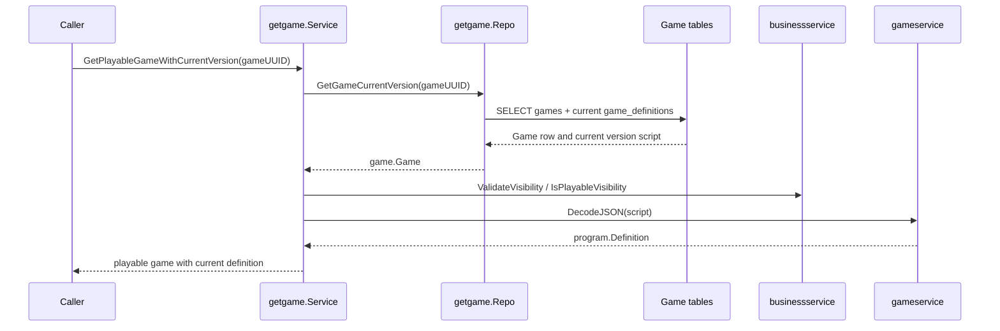
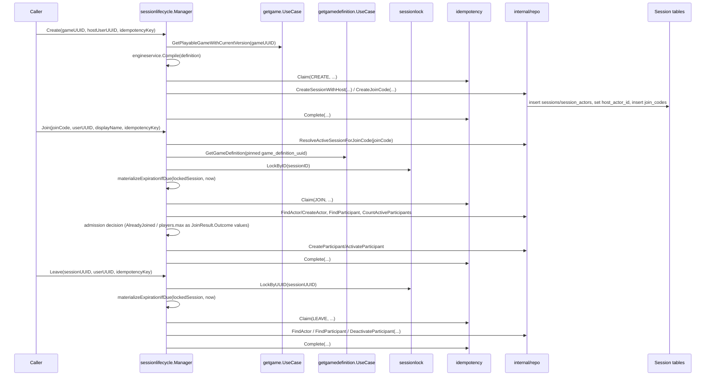
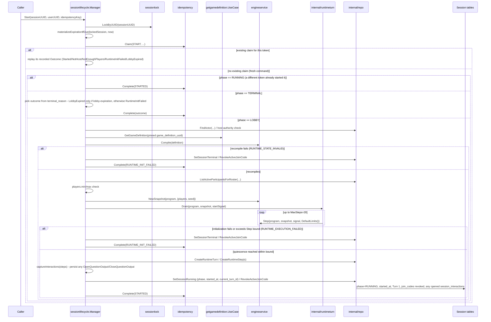
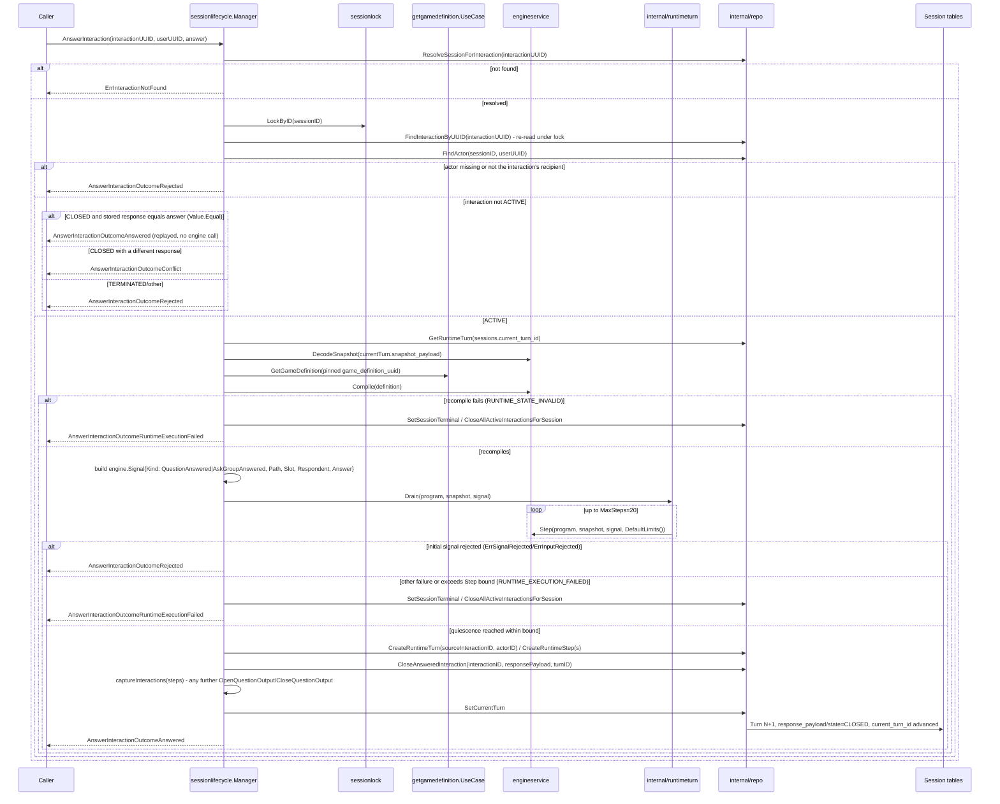

# Game - Flows

Status: CURRENT IMPLEMENTATION

## Retrieve Playable Game With Current Version



Implemented behavior:

- Missing games return no game.
- Non-playable visibility is rejected.
- Invalid visibility and invalid definition scripts are treated as broken game data.

Evidence:

- `game/management/usecases/getgame/service.go`
- `game/management/usecases/getgame/repo.go`
- `game/management/usecases/getgame/service_test.go`
- `game/management/usecases/getgame/repo_test.go`

## Create / Join / Leave Session



## Start Session (First RuntimeTurn)



Implemented behavior:

- `Start` is a step on the same `sessionlifecycle.Manager`, reusing the identical lock/lazy-expiration/idempotency pattern as Create/Join/Leave, plus the existing `pinnedGameReader` dependency Join already established (no new Game Management capability).
- The RuntimeTurn Step-draining/bound execution mechanism (draining `Commit.InternalSignals` in FIFO order, the `MAX_STEPS_PER_RUNTIME_TURN = 20` bound) lives in `internal/runtimeturn.Drain`, shared between Start and AnswerInteraction - scoped to the `sessionlifecycle` workflow package, never at `game/session/internal`. `Drain` is a pure function over `engine`/`engineservice` with no persistence dependency, unit-tested directly without a real database connection (`internal/runtimeturn/runtimeturn_test.go`). `startSessionInTx` itself still owns Turn/Step persistence and calls the shared `captureInteractions` (see below) to record any interaction the Turn opened.
- `StartOutcomeStarted`/`LobbyExpired`/`NotHost`/`NotEnoughPlayers`/`RuntimeInitFailed` are all returned as `StartResult.Outcome` values alongside a `nil` error (GAME-ADR-0022), including the fatal `RuntimeInitFailed` case, which is recorded as the `START` idempotency claim's completed - and replayable - outcome exactly like any other decline.
- Two distinct fatal-path terminal reasons are materialized directly `LOBBY -> TERMINAL` with `started_at` left `NULL` and no Turn/Step/State row written: `RUNTIME_STATE_INVALID` (the pinned Definition unexpectedly fails to recompile - a data-integrity anomaly, since it already compiled at Create) and `RUNTIME_EXECUTION_FAILED` (everything else - `NewSnapshot`/`Step` execution errors, an outright rejection of Start's own initial signal chain, or exceeding the 20-Step bound).
- The `players` root roster is built from active Participants ordered by `joined_at` ascending (ties broken by internal actor id); each `engine.UserValue.ID` is the Participant's internal `session_actors.id`, never `Identity.UserUUID`.
- The idempotency claim is attempted before any phase-based decision, so a same-token retry always replays its own recorded outcome first, regardless of the Session's current phase; only a token with no existing claim (a genuinely fresh command) falls through to a phase-based decision. A concurrent Start that observes the Session already `RUNNING` (a different token already won the lock race) reports `StartOutcomeStarted` directly - already-true current state, not a lobby-expiration decline. A fresh command against an already-`TERMINAL` Session reports the outcome its actual `terminal_reason` explains - `StartOutcomeLobbyExpired` only for lobby expiration, `StartOutcomeRuntimeInitFailed` for a Session terminalized by an earlier Start's own fatal path - never unconditionally the former.
- The current-authoritative-Turn pointer is `sessions.current_turn_id`, not a separate `session_runtime_state` table (GAME-ADR-0023, refining GAME-ADR-0007) - every caller that needs it already holds the locked `sessions` row for per-Session serialization, so colocating it there is free; it is a logical, non-DB-enforced reference like every other reference in this schema.
- `captureInteractions` (`interaction_capture.go`) walks every drained Step's `Outputs` in order and persists each `OpenQuestionOutput` as a new `ACTIVE` `session_interactions` row (`kind` resolved from the compiled `engine.Program`'s own `QuestionSlots`/`AskGroupSlots` declarations) and each `CloseQuestionOutput` as a Turn-produced closure of the matching `ACTIVE` row - shared unchanged between Start's own first Turn and AnswerInteraction's Turn, so no Turn-producing path can silently skip persisting an opened interaction.

Evidence:

- `game/session/workflows/sessionlifecycle/step_start.go`, `interaction_capture.go`, `internal/runtimeturn/runtimeturn.go`, `internal/repo/runtime_turn.go`, `internal/repo/interaction.go`, `internal/repo/session.go`'s `SetSessionRunning`, `internal/repo/participant.go`'s `ListActiveParticipantsForRoster`
- `game/session/internal/storage/migrations/2026091900000{0,1}_*.go` (`session_runtime_turns`/`session_runtime_steps`); `sessions.current_turn_id` is added by `game/session/internal/storage/migrations/20260908000001_sessions.go`'s successor migration (see WORK-0003's revision record); `session_interactions` by `20260919000003_session_interactions.go`

## Answer Interaction (RUNNING-Phase RuntimeTurn)



Implemented behavior:

- `AnswerInteraction` is a step on the same `sessionlifecycle.Manager`, not a separate workflow package - RUNNING-phase execution stays alongside LOBBY admission on one Manager. There is no `session_requests` idempotency record for this operation: the interaction row's own persisted `state`/`response_payload` is the natural dedup identity - a retried, semantically equivalent response replays `Answered` without a second engine effect; a conflicting different response against an already-resolved interaction is rejected as `Conflict`, also without reaching the engine.
- RUNNING-phase per-Session serialization reuses `sessionlock.LockByID` unchanged (GAME-ADR-0018) - the same primitive Create/Join/Leave/Start already use for LOBBY. Execution always reloads `sessions.current_turn_id` and its Snapshot after acquiring the lock, never trusting a pre-lock read.
- Respondent authorization (the caller's resolved `SessionActorID` must equal the interaction's own `session_actor_id`) is checked directly against the persisted row before ever constructing an `engine.Signal`, the same rejection `engineservice.Step` would itself produce for an unauthorized `Respondent` - so an unauthorized caller never reaches the engine at all.
- `engine.Signal.Kind` is constructed from the interaction's own persisted `kind` (`QUESTION` -> `SignalKindQuestionAnswered`, `ASK_GROUP` -> `SignalKindAskGroupAnswered`); `Path`/`Slot` are decoded from the interaction's own persisted `engine_path`/`engine_slot`, addressing the exact workflow instance the question was opened against.
- `engineservice.Step` clears an accepted answer's own question slot internally, before the transition's own authored operations run, and produces no `CloseQuestionOutput` for that closure - `captureInteractions` only ever catches an authored `CloseQuestionOperation` on some *other* slot. The specifically answered interaction is instead closed directly by its already-known id (`CloseAnsweredInteraction`), before `captureInteractions` runs, in the same transaction as the new RuntimeTurn - so an authored transition that reopens the exact same (path, slot, actor) key it just answered never collides with the not-yet-closed old row.
- A rejection of the response itself (`ErrSignalRejected`/`ErrInputRejected` on the *initial* signal only - never on an engine-internally-generated internal signal) is an ordinary declined outcome: no RuntimeTurn, no Snapshot mutation, Session stays `RUNNING`. Any other failure, including exceeding the Step bound, terminalizes the Session `RUNTIME_EXECUTION_FAILED`/`RUNTIME_STATE_INVALID`, atomically closing every currently-`ACTIVE` `session_interactions` row for the Session in the same transaction (`closed_by_turn_id NULL`, `closure_reason = SESSION_TERMINATED`).
- `session_runtime_turns.source_interaction_id`/`actor_id` are populated for AnswerInteraction's own caused Turn (never by Start's).

Evidence:

- `game/session/workflows/sessionlifecycle/step_answer_interaction.go`, `interaction_capture.go`, `internal/runtimeturn/runtimeturn.go`, `internal/repo/interaction.go`
- `game/session/internal/storage/migrations/20260919000003_session_interactions.go`

Implemented behavior:

- One `sessionlifecycle.Manager` workflow controller exposes `Create`/`Join`/`Leave` as its steps; it decides all business/lifecycle policy (admission, lazy lobby-expiration, idempotency-replay meaning) and owns transaction scope by calling `utils.RunInDBTransaction` directly (Manager itself satisfies its `DBServicer` contract) - it holds no separate injected `transactor` dependency. Its narrow `internal/repo` persistence layer reports facts and performs the mutations the Manager requests - it decides no policy itself. Each step calls the shared `sessionlock`/`idempotency` mechanism packages directly rather than through repository forwarding methods.
- `Create` resolves/compiles/pins the Game's current playable Definition and never accepts an externally-supplied `engine.Program`; the host is never created as an active Participant.
- `Join` loads the Session's pinned Definition/Version directly (never the Game's current version) to enforce `players.max`, lazily materializes an expired lobby before rejecting, and rejects a *differently*-tokened Join while already an active Participant as `AlreadyJoined` (GAME-ADR-0021) rather than replaying or silently succeeding. `JOINED`/`LOBBY_EXPIRED`/`LOBBY_FULL`/`ALREADY_JOINED` are all returned as `JoinResult.Outcome` values alongside a `nil` error, never as a Go `error` (GAME-ADR-0022).
- `Leave` deactivates a Participant's slot while keeping the SessionActor durable and host authority unaffected; its own declines (`NOT_IN_LOBBY`, `ACTOR_NOT_FOUND`) are likewise `LeaveResult.Outcome` values, not errors.
- A deterministic business decline discovered after an idempotency claim already succeeded (`AlreadyJoined`, lobby-full, actor-not-found) still commits that claim's completion (with the decline as its outcome) in the same transaction, through the transaction callback's ordinary successful return path - so a same-token retry replays the decline consistently. Lazy lobby-expiration materialization commits the same way. Only an invalid command/protocol contract (missing idempotency token, a same-token conflicting request) or an infrastructure/invariant failure is a Go `error`.
- All three steps reuse the same per-Session DB-locking primitive (`sessionlock`, locked-row facts only) and the same `(user_uuid, operation, idempotency_key)` claim mechanism (`idempotency`, claim/replay mechanics only). The claim mechanism's PostgreSQL implementation is a single non-error `INSERT ... ON CONFLICT DO UPDATE ... RETURNING` upsert (distinguishing a fresh claim from an existing one via the `xmax` system column) rather than a provoke-then-recover unique-violation catch, so a losing claim attempt's transaction is never left aborted.

Evidence:

- `game/session/workflows/sessionlifecycle/` (`manager.go`, `step_create.go`, `step_join.go`, `step_leave.go`, `expiration.go`, `payload.go`, `internal/repo/`)
- `game/session/internal/sessionlock/`, `game/session/internal/idempotency/` (shared cross-cutting mechanics, called directly by the Manager's steps)
- `game/management/usecases/getgamedefinition/`

## Live Transport: Start / AnswerInteraction Fan-Out (WebSocket)

A real client connects over WebSocket and exercises `Start`/`AnswerInteraction` live, with the interaction Session Runtime opens delivered back to it and its answer delivered back to Session Runtime (WORK-0005). `Create`/`Join` stay ordinary HTTP request/response - they happen before any live connection exists.

```
Client                api (transport)        play.Coordinator      play/sessionruntime      sessionlifecycle.Manager      Postgres
  |--POST /sessions------->|                        |                      |                         |                       |
  |                        |---Create-------------->|---Create------------>|---Create--------------->|--commit-------------->|
  |<--session_uuid,--------|<-----------------------|<---------------------|<------------------------|                       |
  |    join_code           |                        |                      |                         |                       |
  |--POST /sessions/join-->|---Join---------------->|---Join--------------->|---Join------------------>|--commit-------------->|
  |<--JOINED----------------|<-----------------------|<---------------------|<------------------------|                       |
  |--GET /ws?session_uuid&user_uuid--(upgrade)------>|                      |                         |                       |
  |                        |---Bind(session,user,conn)->[registered]        |                         |                       |
  |--{"type":"START"}----->|---Start--------------->|---Start-------------->|---Start (Manager)------->|--commit RuntimeTurn-->|
  |                        |                        |                      |---read session_interactions WHERE opened_by_turn_id=current_turn_id (post-commit)--->|
  |                        |                        |<--Events[Opened]------|<------------------------|                       |
  |<--START_RESULT---------|<--fan-out Deliver()----|                      |                         |                       |
  |<--INTERACTION_OPENED---|                        |                      |                         |                       |
  |--{"type":"ANSWER_INTERACTION",answer}-->|--AnswerInteraction-->|--AnswerInteraction-->|--AnswerInteraction (Manager)->|--commit RuntimeTurn-->|
  |                        |                        |                      |---read session_interactions WHERE closed_by_turn_id=current_turn_id (post-commit)--->|
  |                        |                        |<--Events[Closed]------|<------------------------|                       |
  |<--ANSWER_RESULT--------|<--fan-out Deliver()----|                      |                         |                       |
  |<--INTERACTION_CLOSED---|                        |                      |                         |                       |
```

Implemented behavior:

- `api` is organized as one route group per workflow (`api/<workflow>/`, e.g. `api/session/`) composed by a domain-agnostic `api.Server`/`api.NewServer(groups ...RouteGroup)` (`api/server.go`), rather than one flat handler file - `api` is the single transport/application edge for the whole system, so it is expected to keep accumulating route groups as more workflows are exposed. `api/session` owns the HTTP upgrade handshake and one read-pump/write-pump goroutine pair per connection (`api/session/ws.go`); all outbound writes for a connection - both fanned-out `play.Event`s and that same connection's own command results/errors - go through one buffered channel drained by that connection's single write-pump goroutine, since a WebSocket connection supports exactly one concurrent writer.
- `play` (top-level package, sibling of `game`/`api`/`identity`) is the Live Session Coordinator: an in-process, per-Session registry of bound connections (`Coordinator.Bind`/`Coordinator.Deliver`), never touching `game` directly. It declares the `SessionRuntime` port it depends on; nothing `play` exports references a `game` type (verified by `go list -deps ./play` containing no `game/...` package, and `go list -deps ./game/...` containing neither `play` nor `api`). `Coordinator.Start`/`AnswerInteraction` return the resulting Events instead of delivering them internally, so a route group can enqueue its own direct reply before calling `Coordinator.Deliver` - otherwise a fanned-out Event could reach a client before the direct reply to the command that caused it, when that client is also one of the Event's recipients.
- `play/sessionruntime` implements that port by calling the existing, unmodified `sessionlifecycle.Manager`. Since `Manager` never returns `engine.Output` values to its caller (and this slice does not change that), `play/sessionruntime` reads back the committed `RuntimeTurn`'s `session_interactions` rows (`opened_by_turn_id`/`closed_by_turn_id` = `sessions.current_turn_id`, GAME-ADR-0023) after `Manager`'s own call has already durably committed and reported success, and translates them into `play.Event`s - the durable record `interaction_capture.go` already writes for exactly `OpenQuestionOutput`/`CloseQuestionOutput`, never any other `Output` variant (Blocker 4's resolved scope). The translation never leaks `engine_path`/`Slot`/`SessionActorID`: a recipient is resolved through `session_actors.user_uuid` to the caller-facing `UserUUID` the client itself supplied.
- Delivery is best-effort and strictly post-commit (GAME-ADR-0020): `Coordinator` never sees an `Event` until `SessionRuntime`'s call has already returned success, and a `Conn.Deliver` failure is only ever logged - it never reopens, retries, or reinterprets the already-committed Session state. A recipient with no bound connection simply receives nothing.
- `(SessionUUID, UserUUID)` connection binding extends Slice 1's already-established trusted-caller stance (no Identity implementation exists yet): the client supplies `UserUUID` directly as a `GET /ws` query parameter; real credential verification is deferred to a future Identity/Auth slice.
- The client's submitted answer rides the WebSocket as the engine's own `engineservice.EncodeValue` wire format - the same codec `session_interactions.response_payload` already persists through, reused rather than inventing a second value encoding for this thin slice.
- `api/session` is the one entry point that starts a request log (`logging.Start`/`defer logging.FinishRequestLog`): once per HTTP request, once per WebSocket connect/disconnect event, and once per individual inbound WS message (a long-lived connection is many logged exchanges, not one). `play.Coordinator` and `play/sessionruntime.SessionRuntime` add their own `logging.Step` nested under whichever entry point called them, the same way `sessionlifecycle.Manager` already did - so one flushed structured log line covers the full path from HTTP/WS entry point down through Manager (`docs/engineering/standards/logging.md`).

Evidence:

- `play/play.go`, `play/coordinator.go`, `play/README.md`
- `play/sessionruntime/sessionruntime.go`, `play/sessionruntime/query.go`, `play/sessionruntime/wiring.go`
- `api/server.go`, `api/session/handler.go`, `api/session/http.go`, `api/session/ws.go`, `api/session/wire.go`, `api/internal/httpx/json.go`
- `docs/work/active/WORK-0005-thin-live-coordinator.md`

## Not Documented As Implemented

- Session Runtime timer obligations, the `session_runtime_failures` diagnostic entity, disconnect/reconnect, resync, and inactivity expiration (see `docs/ai/workspaces/active/session-runtime-v1/PLAN.md` Slices 5-8). The Coordinator/WebSocket transport above is deliberately thin: no disconnect grace/debounce, no semantic presence, no timer scheduling, no reconnect/resync - a client that disconnects simply stops receiving further messages until Slice 7 exists.
