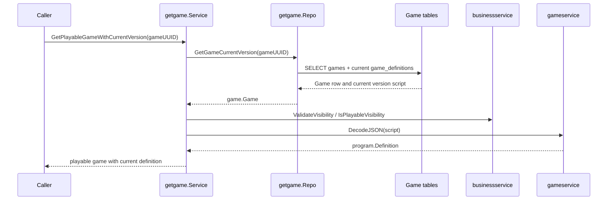

# Game Management - Flows

Status: CURRENT IMPLEMENTATION

## Retrieve Playable Game With Current Version

```mermaid
sequenceDiagram
    participant Caller
    participant UseCase as getgame.Service
    participant Repo as getgame.Repo
    participant DB as Game tables
    participant Rules as businessservice
    participant Language as gameservice

    Caller->>UseCase: GetPlayableGameWithCurrentVersion(gameUUID)
    UseCase->>Repo: GetGameCurrentVersion(gameUUID)
    Repo->>DB: SELECT games + current game_definitions
    DB-->>Repo: Game row and current version script
    Repo-->>UseCase: game.Game
    UseCase->>Rules: ValidateVisibility / IsPlayableVisibility
    UseCase->>Language: DecodeJSON(script)
    Language-->>UseCase: program.Definition
    UseCase-->>Caller: playable game with current definition
```

Implemented behavior:

- Missing games return no game.
- Non-playable visibility is rejected.
- Invalid visibility and invalid definition scripts are treated as broken game data.
- No caller inside this repository currently invokes this use case: Session Runtime's `Create` resolves its own current version entirely from its own tables instead (`docs/projects/active/js-runtime-migration/works/WORK-0034-session-owned-executable-script-artifact-and-package-restructuring.md`). This capability remains implemented and tested for a future caller (for example Composer's visibility gate, `docs/projects/active/js-runtime-migration/works/WORK-0032-composer-mediated-session-creation-visibility-check.md`).

Evidence:

- `game/usecases/getgame/service.go`
- `game/usecases/getgame/repo.go`
- `game/usecases/getgame/service_test.go`
- `game/usecases/getgame/repo_test.go`
