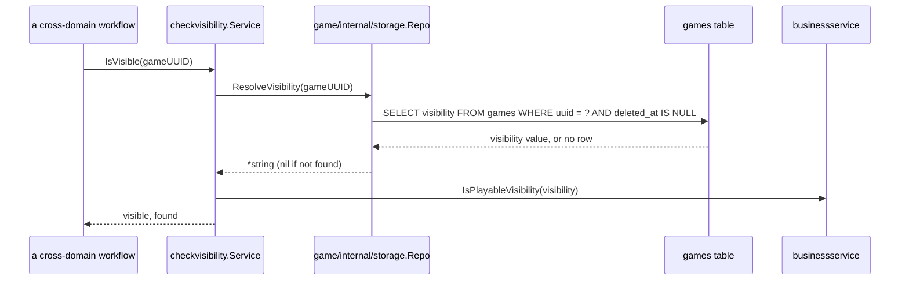

# Game Management - Flows

Status: CURRENT IMPLEMENTATION

## Check Game Visibility

```mermaid
sequenceDiagram
    participant Caller as a cross-domain workflow
    participant UseCase as checkvisibility.Service
    participant Repo as game/internal/storage.Repo
    participant DB as games table
    participant Rules as businessservice

    Caller->>UseCase: IsVisible(gameUUID)
    UseCase->>Repo: ResolveVisibility(gameUUID)
    Repo->>DB: SELECT visibility FROM games WHERE uuid = ? AND deleted_at IS NULL
    DB-->>Repo: visibility value, or no row
    Repo-->>UseCase: *string (nil if not found)
    UseCase->>Rules: IsPlayableVisibility(visibility)
    UseCase-->>Caller: visible, found
```

Implemented behavior:

- Resolves only `games.visibility` by `games.uuid` - no join, no script/definition decode of any kind (Game Management owns no version/definition concept - see `game/docs/DATA_MODEL.md`).
- A missing or soft-deleted Game reports `found = false`.
- `found = true, visible = false` for `draft`/`private`; `found = true, visible = true` for `hidden`/`public` (`businessservice.IsPlayableVisibility`).
- Not called by any workflow at present: Orchestrator's former `CreateSession` was removed with the previous Session Runtime implementation.

Evidence:

- `game/usecases/checkvisibility/service.go`
- `game/usecases/checkvisibility/service_test.go`
- `game/internal/storage/repo.go`
- `game/internal/storage/repo_test.go`
