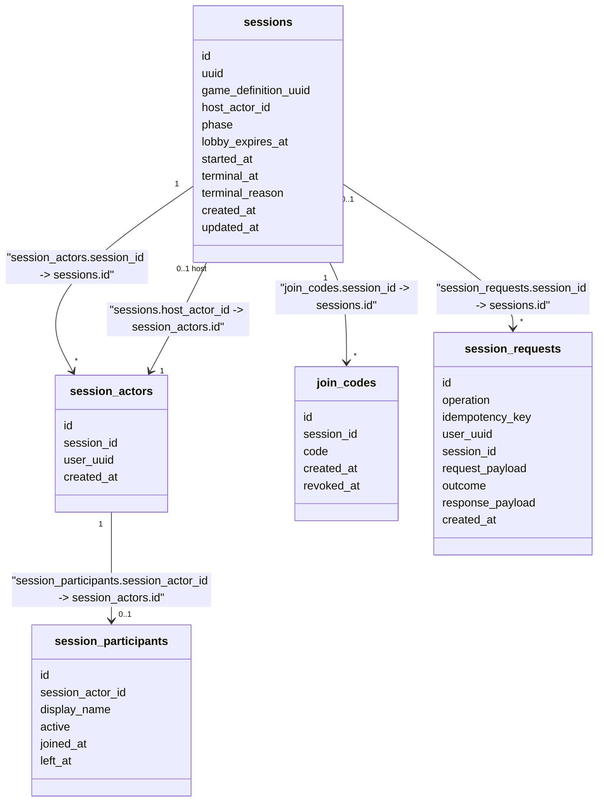
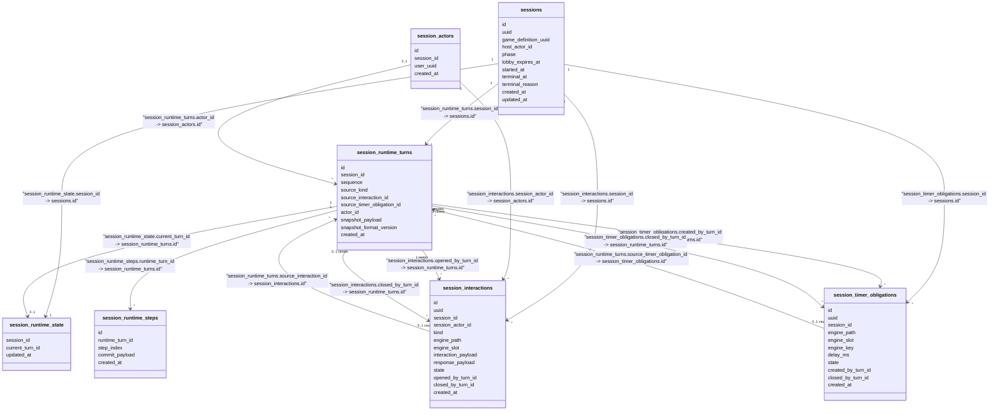
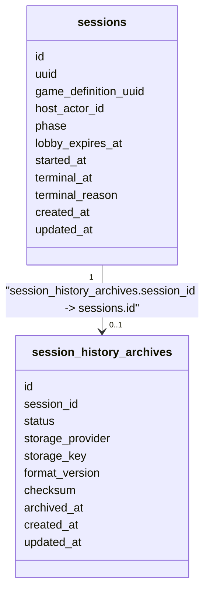

# Session Runtime - Persistence Model (Accepted Design)

Status: ACCEPTED DESIGN, NOT YET IMPLEMENTED AS PERSISTED SCHEMA.

This document preserves the HUMAN-APPROVED Session Runtime persistence and runtime-history/archive schema for the `session-runtime-v1` initiative. It describes accepted future design, not current implementation. For the actually persisted schema, see `game/docs/DATA_MODEL.md`.

Rationale and alternatives are recorded in:

- `game/docs/decisions/GAME-ADR-0007-session-runtime-turn-and-persistence-model.md` (RuntimeTurn as the historical unit, RuntimeStep as technical trace, the core tables, Turn/Interaction/Timer relationships).
- `game/docs/decisions/GAME-ADR-0008-session-runtime-v1-timer-recovery-simplification.md` (no durable `live_timer_schedules`, V1 recovery tradeoff).
- `game/docs/decisions/GAME-ADR-0009-session-runtime-history-archival-and-hard-delete.md` (long-term archive metadata and verified hard-delete policy).
- `game/docs/decisions/GAME-ADR-0012-game-language-keyed-timer-slots.md` (keyed timer slot capability and the `session_timer_obligations.engine_key` persistence consequence below).

## Central Concept: RuntimeTurn vs RuntimeStep

One `RuntimeTurn` begins from one external/runtime cause and may execute 1..N internal `engine.Step` calls, all within the same transaction. Only the final Snapshot after the whole Turn is an observable/authoritative Session state; one committed Turn corresponds to one Session runtime `sequence` and one historical Snapshot.

`RuntimeStep` is technical execution history only (engine debugging/audit). It does not own a Session-state sequence.

## Lobby And Identity Tables



Logical cross-domain references (no database FK):

- `sessions.game_definition_uuid` -> Game Management `game_definitions.uuid`.
- `session_actors.user_uuid` -> Identity `User.user_uuid`.
- `session_requests.user_uuid` -> Identity `User.user_uuid`.

## Runtime History Tables



`session_runtime_state` duplicates no Snapshot payload: current Session runtime state is defined as the Snapshot stored on the Turn referenced by `current_turn_id`.

### Turn / Interaction / Timer Worked Example

Interaction flow:

```text
Turn 10  -> opens Interaction Q1        (Q1.opened_by_turn_id = 10)
Q1 response -> causes Turn 12           (Turn12.source_interaction_id = Q1)
Turn 12  -> closes Q1                   (Q1.closed_by_turn_id = 12)
```

Timer flow:

```text
Turn 20  -> creates Timer T1            (T1.created_by_turn_id = 20)
Coordinator reports T1 elapsed -> causes Turn 25   (Turn25.source_timer_obligation_id = T1)
Turn 25  -> closes T1                   (T1.closed_by_turn_id = 25, T1.state = CONSUMED)
```

A Turn may instead close a timer with `state = CANCELLED` without that timer ever being the Turn's `source`.

## No Durable `live_timer_schedules` In V1

`live_timer_schedules` (a previously proposed Coordinator-owned durable physical-schedule table) is rejected for V1 and is not part of this schema. Session Runtime persists only the timer obligation and its `delay_ms`; it does not calculate or persist an absolute deadline. The Coordinator owns physical timers in memory. On recovery, active obligations may be rescheduled using their full configured `delay_ms` from the new scheduling moment; preserving elapsed wall-clock time across a full process restart is not required for V1. See GAME-ADR-0008.

`lobby_expires_at` on `sessions` is unrelated to this rule - it is an existing accepted Session lifecycle deadline, not a Game Language timer schedule.

## Keyed Timer Discriminator

`session_timer_obligations.engine_key` is a nullable internal Session/engine routing field accepted alongside `engine_path`/`engine_slot`/`delay_ms`/`state`/Turn relationships, to support the accepted Game Language keyed-timer-slot capability (GAME-ADR-0012):

- Ordinary `TimerSlot` timer: `engine_path = ...`, `engine_slot = ...`, `engine_key = NULL`.
- Keyed timer: `engine_path = ...`, `engine_slot = ...`, `engine_key = <serialized authored key>`.

`engine_key` is internal Session/engine routing metadata only - it exists so Session Runtime can reconstruct the correct `KeyedTimerExpired(slot)` signal (carrying the authored `key`) on recovery. It must never be exposed directly to Coordinator/frontend merely because it is persisted. The concrete serialized/typed representation of `engine_key` is not frozen by this document; it depends on the not-yet-designed keyed-timer-slot compiler/engine implementation.

## Archive Metadata



`status` is `PENDING | READY | FAILED` or an equivalent enum. `storage_provider`/`storage_key` identify the archive object; an expiring/public URL is not persisted. The final JSON archive schema and GCS implementation are deferred (see GAME-ADR-0009). The archive must eventually preserve whatever `engine_key`/keyed-timer metadata is necessary to understand/replay archived keyed-timer history (see GAME-ADR-0012); the concrete archive JSON format remains deferred here regardless.

## Archival And Hard-Delete Policy

Hot runtime/history tables become an explicit hard-delete exception only after: the archive is successfully written; checksum verification succeeds; and `session_history_archives.status = READY`. If archival/verification fails, no hard delete occurs.

Candidate removable hot runtime data:

- `session_runtime_state`
- `session_runtime_turns`
- `session_runtime_steps`
- `session_interactions`
- `session_timer_obligations`

Explicitly excluded from this deletion policy, and retained indefinitely for product queries (a User's session history, who hosted a Session, who participated):

- `session_actors`
- `session_participants`

Retention of `session_requests`, `join_codes`, and other lightweight lifecycle metadata is unchanged by this decision.

## Relationship Types

No database-enforced foreign key constraints are assumed by this accepted design, consistent with current Game migrations. All relationships above are logical persisted references unless a future implementation decision introduces enforced FKs.

Logical cross-domain references (no database FK, different domain):

- `sessions.game_definition_uuid -> game_definitions.uuid` (Game Management)
- `session_actors.user_uuid -> Identity.User` (Identity)
- `session_requests.user_uuid -> Identity.User` (Identity)

## Not Yet Decided

- The final JSON archive schema.
- The GCS (or other object storage) integration and archival/verification worker implementation.
- The idempotency JSON canonicalization/comparison algorithm for `session_requests`.
- The exhaustive `source_kind` and interaction/terminal-reason enums.
- The concrete `KeyedTimerSlot<Key>` declaration/operation/signal-source design and the serialized/typed representation of `engine_key` (see GAME-ADR-0012).
