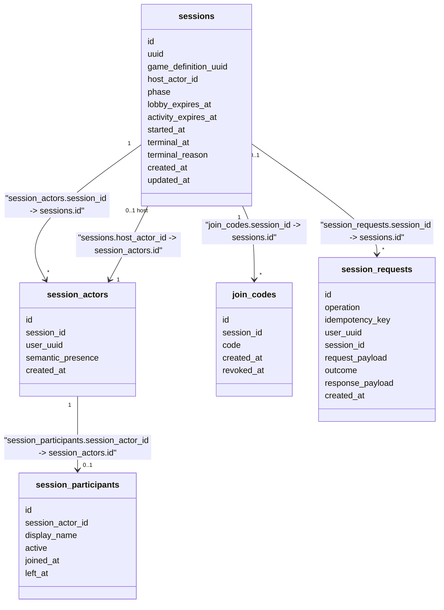
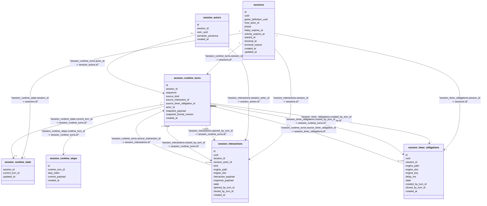
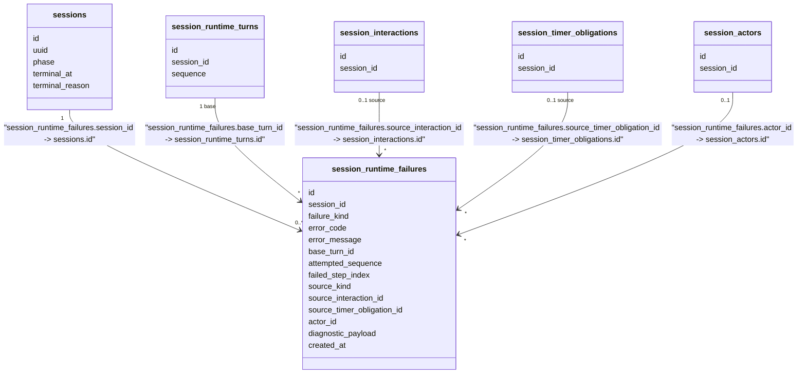
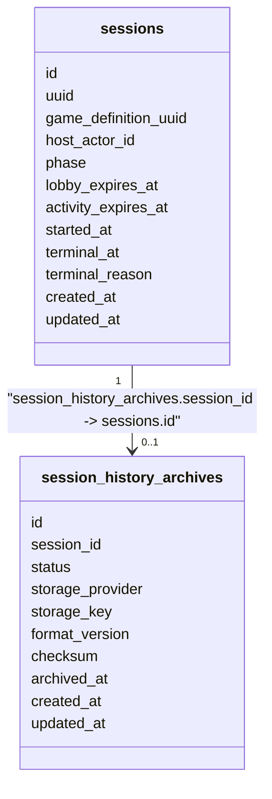

# Session Runtime - Persistence Model (Accepted Design)

Status: ACCEPTED DESIGN, NOT YET IMPLEMENTED AS PERSISTED SCHEMA.

This document preserves the HUMAN-APPROVED Session Runtime persistence and runtime-history/archive schema for the `session-runtime-v1` initiative. It describes accepted future design, not current implementation. For the actually persisted schema, see `game/docs/DATA_MODEL.md`.

Rationale and alternatives are recorded in:

- `game/docs/decisions/GAME-ADR-0007-session-runtime-turn-and-persistence-model.md` (RuntimeTurn as the historical unit, RuntimeStep as technical trace, the core tables, Turn/Interaction/Timer relationships).
- `game/docs/decisions/GAME-ADR-0008-session-runtime-v1-timer-recovery-simplification.md` (no durable `live_timer_schedules`, V1 recovery tradeoff).
- `game/docs/decisions/GAME-ADR-0009-session-runtime-history-archival-and-hard-delete.md` (long-term archive metadata and verified hard-delete policy).
- `game/docs/decisions/GAME-ADR-0012-game-language-keyed-timer-slots.md` (keyed timer slot capability and the `session_timer_obligations.engine_key` persistence consequence below).
- `game/docs/decisions/GAME-ADR-0013-session-runtime-process-agnostic-recovery.md` (process-agnostic recovery, RuntimeTurn crash/commit semantics, reconstruction from current checkpoint rather than event replay).
- `game/docs/decisions/GAME-ADR-0014-session-runtime-durable-inactivity-expiration.md` (`activity_expires_at` as the RUNNING-phase inactivity deadline and source of truth, renewal, lazy materialization, Reaper role, and the Archive Worker boundary below).
- `game/docs/decisions/GAME-ADR-0015-session-actor-semantic-presence-and-lobby-membership.md` (`session_actors.semantic_presence`, its distinction from `session_participants.active`, and phase-dependent LOBBY/RUNNING disconnect consequences below).
- `game/docs/decisions/GAME-ADR-0016-session-semantic-presence-recovery-after-total-coordinator-state-loss.md` (recovery-grace behavior after total Coordinator/process loss and the RUNNING atomic semantic-presence/Game-Language-processing rule in the Process-Agnostic Recovery section below; introduces no new durable field/table).
- `game/docs/decisions/GAME-ADR-0017-session-runtime-failure-classification-and-diagnostic-persistence.md` (the four-class failure taxonomy, the `session_runtime_failures` diagnostic entity introduced below, the RuntimeTurn failure boundary, atomic fatal materialization, and the archival/queryability exception below).

## Central Concept: RuntimeTurn vs RuntimeStep

One `RuntimeTurn` begins from one external/runtime cause and may execute 1..N internal `engine.Step` calls, all within the same transaction. Only the final Snapshot after the whole Turn is an observable/authoritative Session state; one committed Turn corresponds to one Session runtime `sequence` and one historical Snapshot.

`RuntimeStep` is technical execution history only (engine debugging/audit). It does not own a Session-state sequence.

## SessionActor Semantic Presence vs Participant Admission

`session_actors.semantic_presence` (`CONNECTED | DISCONNECTED`) is a durable platform/runtime fact: has this SessionActor crossed the Coordinator -> Session semantic connected/disconnected boundary? It is not physical connection state - socket IDs, connection IDs, live WebSocket bindings, Coordinator grace timers, and process IDs remain ephemeral Coordinator-owned state and are never persisted here. `semantic_presence` only changes after the Coordinator's transport grace has already been applied and has already expired (see GAME-ADR-0010, GAME-ADR-0015).

`session_participants.active` answers a different, phase-dependent question: does this actor currently occupy/admit a participant position? During `LOBBY`, `active` means currently admitted / currently occupying a Start-eligible lobby slot, and a semantic disconnect deactivates it (releasing the slot) exactly as a `Leave` would. After `Start`, the Game runtime roster is the immutable initial set of active Participants selected at the serialized Start moment; a later semantic disconnect during `RUNNING` does **not** deactivate `session_participants.active` or free that roster position - RUNNING disconnect consequences are delegated to authored Game Language (`UserDisconnected`/`UserReconnected`, GAME-ADR-0011), not decided by `active`.

These two fields may legitimately diverge - for example, a SessionActor reconnects successfully (`semantic_presence = CONNECTED`) while the lobby is already full, so its Participant remains inactive (`active = false`) and no slot is reserved. See GAME-ADR-0015 for the full accepted phase-dependent rule set (LOBBY disconnect/reconnect admission, the Start active-Participants-only roster, and RUNNING disconnect preserving runtime membership).

## Lobby And Identity Tables



Logical cross-domain references (no database FK):

- `sessions.game_definition_uuid` -> Game Management `game_definitions.uuid`.
- `session_actors.user_uuid` -> Identity `User.user_uuid`.
- `session_requests.user_uuid` -> Identity `User.user_uuid`.

## Runtime History Tables



`session_runtime_state` duplicates no Snapshot payload: current Session runtime state is defined as the Snapshot stored on the Turn referenced by `current_turn_id`.

### Turn / Interaction / Timer Worked Example

Interaction flow:

```text
Turn 10  -> opens Interaction Q1        (Q1.opened_by_turn_id = 10)
Q1 response -> causes Turn 12           (Turn12.source_interaction_id = Q1)
Turn 12  -> closes Q1                   (Q1.closed_by_turn_id = 12)
```

Timer flow:

```text
Turn 20  -> creates Timer T1            (T1.created_by_turn_id = 20)
Coordinator reports T1 elapsed -> causes Turn 25   (Turn25.source_timer_obligation_id = T1)
Turn 25  -> closes T1                   (T1.closed_by_turn_id = 25, T1.state = CONSUMED)
```

A Turn may instead close a timer with `state = CANCELLED` without that timer ever being the Turn's `source`.

## Session Runtime Failure Diagnostics

`session_runtime_failures` is a conceptual future entity, separate from `session_runtime_turns` and not owning an authoritative Snapshot, that durably records a fatal (`RUNTIME_EXECUTION`/`RUNTIME_STATE_INVALID`) runtime failure - the technical diagnosis of *why* a Session became `TERMINAL` from an internal execution/state failure, not an authoritative gameplay record. See GAME-ADR-0017 for the full four-class failure taxonomy (expected rejection, deterministic execution failure, durable state invalidity, transient infrastructure failure) and the reasoning behind this entity.



Cardinality notes:

- A Session normally has zero fatal `session_runtime_failures` records for its entire lifetime (the common case), or exactly one, since a fatal execution/state-invalidity failure terminalizes the Session (GAME-ADR-0017) and a `TERMINAL` Session does not resume executing to fail again. This document does not freeze a database uniqueness constraint on `(session_id)` unless a later repository-convention review clearly warrants one; the relationship above is drawn as `0..*` to avoid over-constraining an unimplemented design.
- `base_turn_id` is required (a fatal attempt always executes from some last-valid committed Turn, even if that Turn is only the Start-produced initial Turn).
- `source_interaction_id`/`source_timer_obligation_id`/`actor_id` are nullable, mirroring the equivalent nullable `source_*` fields already accepted on `session_runtime_turns`.
- `attempted_sequence` and `failed_step_index` are plain diagnostic integers, not foreign keys - they do not reference any row in `session_runtime_turns`/`session_runtime_steps`, since the attempted Turn/Step never committed and therefore never existed as a persisted row (see GAME-ADR-0017's RuntimeTurn failure boundary).
- `SessionRuntimeFailure` is not a RuntimeTurn: it owns no Snapshot, does not advance `session_runtime_state.current_turn_id`, and is never itself the `base_turn_id`/`source_*` target of another Turn or failure record.

## No Durable `live_timer_schedules` In V1

`live_timer_schedules` (a previously proposed Coordinator-owned durable physical-schedule table) is rejected for V1 and is not part of this schema. Session Runtime persists only the timer obligation and its `delay_ms`; it does not calculate or persist an absolute deadline. The Coordinator owns physical timers in memory. On recovery, active obligations may be rescheduled using their full configured `delay_ms` from the new scheduling moment; preserving elapsed wall-clock time across a full process restart is not required for V1. See GAME-ADR-0008.

`lobby_expires_at` on `sessions` is unrelated to this rule - it is an existing accepted Session lifecycle deadline, not a Game Language timer schedule.

## Keyed Timer Discriminator

`session_timer_obligations.engine_key` is a nullable internal Session/engine routing field accepted alongside `engine_path`/`engine_slot`/`delay_ms`/`state`/Turn relationships, to support the accepted Game Language keyed-timer-slot capability (GAME-ADR-0012):

- Ordinary `TimerSlot` timer: `engine_path = ...`, `engine_slot = ...`, `engine_key = NULL`.
- Keyed timer: `engine_path = ...`, `engine_slot = ...`, `engine_key = <serialized authored key>`.

`engine_key` is internal Session/engine routing metadata only - it exists so Session Runtime can reconstruct the correct `KeyedTimerExpired(slot)` signal (carrying the authored `key`) on recovery. It must never be exposed directly to Coordinator/frontend merely because it is persisted. The concrete serialized/typed representation of `engine_key` is not frozen by this document; it depends on the not-yet-designed keyed-timer-slot compiler/engine implementation.

## Process-Agnostic Recovery

Session Runtime does not persist any process/instance ownership state (no `owner_process_id`, no heartbeat, no fencing/takeover generation, no durable `RECOVERING` phase). Recovery of a `RUNNING` Session reconstructs current state from `sessions`, `session_runtime_state.current_turn_id`, the final Snapshot stored on that RuntimeTurn, active `session_interactions`, and active `session_timer_obligations` - not by replaying `session_runtime_turns`/`session_runtime_steps` history. An uncommitted RuntimeTurn transaction at the moment of process death rolls back entirely via ordinary database transaction atomicity; a committed RuntimeTurn remains authoritative regardless of which process executed it or what happened immediately after commit. See GAME-ADR-0013.

Total process loss does not itself mutate `session_actors.semantic_presence` (GAME-ADR-0015); durable `CONNECTED`/`DISCONNECTED` values are ordinary rows unaffected by ephemeral Coordinator state loss, requiring no recovery-specific persistence. For a RUNNING runtime member, the `semantic_presence` transition (`CONNECTED <-> DISCONNECTED`) and its corresponding `UserDisconnected`/`UserReconnected` Game Language processing commit within one Session transaction, extending the same RuntimeTurn atomicity guarantee above to the presence mutation itself: if the transaction does not commit, the presence edge did not occur authoritatively and durable state remains at its prior value; if it commits, presence and any resulting RuntimeTurn/consequences are already authoritative together. No new column/table is introduced for this - `session_actors.semantic_presence` already exists (GAME-ADR-0015), and Coordinator's post-crash recovery-grace mechanism remains entirely ephemeral, non-durable state. See GAME-ADR-0016.

## RUNNING Inactivity Deadline: `activity_expires_at`

`sessions.activity_expires_at` is a durable inactivity deadline for `RUNNING` Sessions, distinct from `lobby_expires_at`. It is not a process ownership lease.

- **Source of truth**: expiration is true because `now >= activity_expires_at`, independent of whether/when a Reaper observes it.
- **Renewal**: meaningful Session operations (RuntimeTurn-producing gameplay, accepted interaction processing, timer expiration processing, meaningful lifecycle/runtime events, justified reconnect/resume activity) extend `activity_expires_at = now + inactivity_ttl`. `inactivity_ttl` is configurable operational/product policy (V1 illustrative value around 10 minutes), not a Game Language constant. Passive reads/polling must not renew it.
- **Validation**: any active-dependent operation must, under the same per-Session serialization used for other mutations, load/lock the Session, validate lifecycle, and compare `now` against `activity_expires_at` before processing; an operation arriving after the deadline must not revive a Session merely because persisted `phase` still reads `RUNNING`.
- **Lazy materialization**: such an operation may instead atomically materialize `phase = TERMINAL`, `terminal_reason = RUNTIME_INACTIVITY_EXPIRED`, `terminal_at = activity_expires_at` in the same transaction, then reject the original action - never renewing, reopening, fabricating gameplay, or creating a RuntimeTurn merely to represent expiration.
- **Reaper**: a background job proactively finds `phase = RUNNING AND activity_expires_at <= now` and, under the same serialization/revalidation rules, materializes `TERMINAL`/`RUNTIME_INACTIVITY_EXPIRED` if still expired; it does not determine expiration, only surfaces an already-true condition. If a legitimate operation already renewed the deadline first, the Reaper rechecks and does nothing.
- **`terminal_at` rule**: always equals `activity_expires_at`, never the Reaper's or a lazy operation's current wall-clock time - preserving the correct semantic terminal instant even across a long platform outage.
- **`terminal_reason = RUNTIME_INACTIVITY_EXPIRED`**: means only that the `RUNNING` Session exceeded its allowed inactivity period; it does not assert a process crash, pod kill, host disconnect, or that every participant left.
- **Archive Worker boundary**: the Archive Worker (see Archival And Hard-Delete Policy below) consumes only already-materialized `TERMINAL` Sessions per retention policy; it must not inspect process ownership, detect crashes, determine RUNNING inactivity, or interpret `activity_expires_at`.

Interaction/timer closure semantics for still-open `session_interactions`/`session_timer_obligations` at inactivity termination remain a later implementation/design detail; materializing expiration must never fabricate engine responses or RuntimeTurns to close gameplay. See GAME-ADR-0014.

## Archive Metadata



`status` is `PENDING | READY | FAILED` or an equivalent enum. `storage_provider`/`storage_key` identify the archive object; an expiring/public URL is not persisted. The final JSON archive schema and GCS implementation are deferred (see GAME-ADR-0009). The archive must eventually preserve whatever `engine_key`/keyed-timer metadata is necessary to understand/replay archived keyed-timer history (see GAME-ADR-0012); the concrete archive JSON format remains deferred here regardless.

## Archival And Hard-Delete Policy

Hot runtime/history tables become an explicit hard-delete exception only after: the archive is successfully written; checksum verification succeeds; and `session_history_archives.status = READY`. If archival/verification fails, no hard delete occurs.

Candidate removable hot runtime data:

- `session_runtime_state`
- `session_runtime_turns`
- `session_runtime_steps`
- `session_interactions`
- `session_timer_obligations`

Explicitly excluded from this deletion policy, and retained indefinitely for product queries (a User's session history, who hosted a Session, who participated):

- `session_actors`
- `session_participants`

`session_runtime_failures` (see Session Runtime Failure Diagnostics above) is likewise excluded from this automatic hard-delete policy. Lightweight fatal-runtime-failure metadata remains relationally queryable in PostgreSQL after heavy runtime-history archival, supporting operational/product queries such as failure counts by error code or by game definition (see GAME-ADR-0017). This is unlike the heavy per-Turn/per-Step tables above because failure records are low-volume by construction - a Session normally produces at most one. A separate retention/compaction strategy for large `diagnostic_payload` content may be designed later if payload volume ever warrants it; it is not designed here.

Retention of `session_requests`, `join_codes`, and other lightweight lifecycle metadata is unchanged by this decision.

## Relationship Types

No database-enforced foreign key constraints are assumed by this accepted design, consistent with current Game migrations. All relationships above are logical persisted references unless a future implementation decision introduces enforced FKs.

Logical cross-domain references (no database FK, different domain):

- `sessions.game_definition_uuid -> game_definitions.uuid` (Game Management)
- `session_actors.user_uuid -> Identity.User` (Identity)
- `session_requests.user_uuid -> Identity.User` (Identity)

## Not Yet Decided

- The final JSON archive schema.
- The GCS (or other object storage) integration and archival/verification worker implementation.
- The idempotency JSON canonicalization/comparison algorithm for `session_requests`.
- The exhaustive `source_kind` and interaction/terminal-reason enums.
- The concrete `KeyedTimerSlot<Key>` declaration/operation/signal-source design and the serialized/typed representation of `engine_key` (see GAME-ADR-0012).
- The exact enumeration of renewal-triggering operations for `activity_expires_at` and the concrete `inactivity_ttl` configuration surface (see GAME-ADR-0014).
- The persistence-state transitions/closure reasons for still-open `session_interactions`/`session_timer_obligations` at inactivity termination (see GAME-ADR-0014).
- The exact SQL types/column names, indexing, and any uniqueness constraint for `session_runtime_failures`; the concrete `diagnostic_payload` JSON schema/version; the exhaustive `failure_kind`/`source_kind` enums; and the large-diagnostic-payload retention/compaction strategy (see GAME-ADR-0017).
