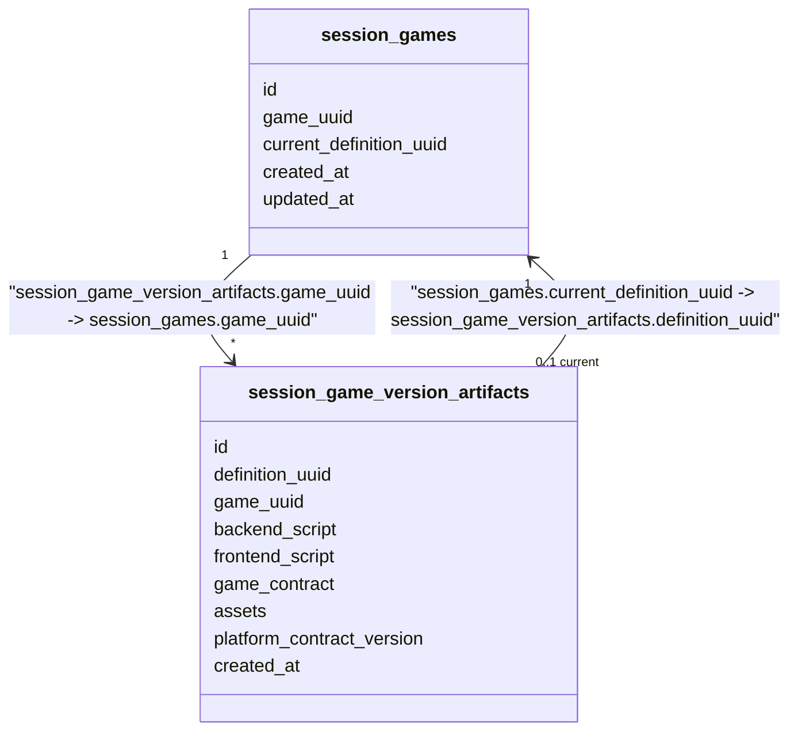
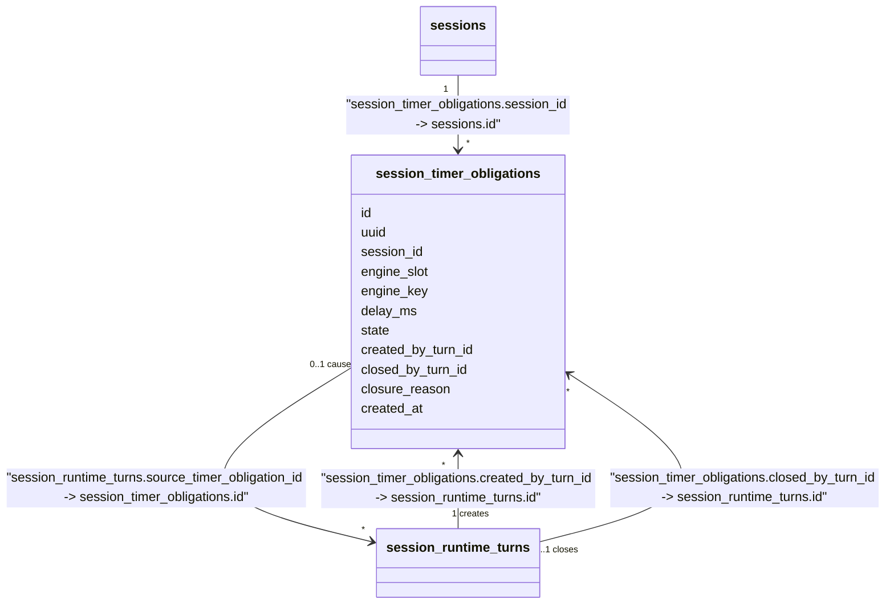
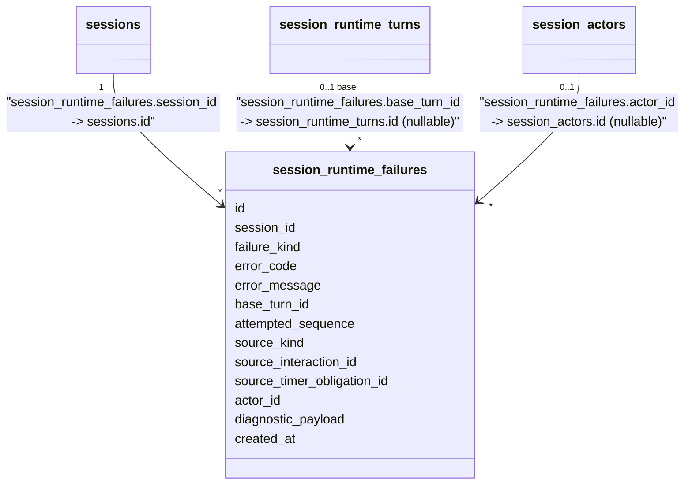

# Session Runtime - Data Model

Status: CURRENT IMPLEMENTATION

Game Management's own tables (`games`/`game_definitions`/`game_images`/`game_histories`/`game_definition_histories`) are documented in `game/docs/DATA_MODEL.md`, not here - no database transaction spans Game Management-owned and Session-Runtime-owned tables (`ARCHITECTURE.md -> State and Transaction Boundaries`).

## Game Version Artifact Tables

`session_games`/`session_game_version_artifacts` are Session Runtime's own persisted copy of the executable Game Version Artifact (`session/docs/GAME_VERSION_ARTIFACT_MODEL.md`), read only by `Create` (`docs/projects/active/js-runtime-migration/works/WORK-0034-session-owned-executable-script-artifact-and-package-restructuring.md`). `session_games` holds one row per Game public UUID, pointing at its current pinnable version; `session_game_version_artifacts` holds one row per immutable version, storing the mandatory `backend_script`/`frontend_script` plus the optional `game_contract`/`assets`/`platform_contract_version` fields the artifact model defines. `game_uuid` on the artifact table is Session Runtime's own addition beyond the artifact model itself, needed to resolve "current version for this Game" without a Game Management call - it is not part of `GameVersionArtifact`'s own canonical shape. The two tables carry a real, same-domain FK pair (not a logical reference): `session_game_version_artifacts.game_uuid -> session_games.game_uuid`, and `session_games.current_definition_uuid -> session_game_version_artifacts.definition_uuid`. Nothing yet populates these tables for a real, published Game version - the publish path (`docs/projects/active/js-runtime-migration/works/WORK-0033-cross-domain-game-publish-composition.md`) is not yet implemented.



## Session Runtime Tables

Status: this replaces the pre-Slice-1 `sessions`/`session_players`/`session_states`/`join_codes` shape - see WORK-0001's Data/Migration Impact. Slice 2 (WORK-0003) added `session_runtime_turns`/`session_runtime_steps` and `sessions.current_turn_id` (SESSION-ADR-0022 - a logical, non-DB-enforced pointer to the current authoritative RuntimeTurn, colocated on `sessions` rather than a separate `session_runtime_state` table). Slice 3 (WORK-0004) added `session_interactions`. WORK-0019 (replay-first persistence, SESSION-ADR-0023) then removed `session_runtime_turns.snapshot_payload`/`snapshot_format_version` and `session_runtime_steps` in full, and added `session_runtime_starts` (Start's durable `Seed`/`RootParameters`) and `session_cause_events` (an unpopulated satellite table for a future RuntimeTurn cause with no existing normalized home) plus `session_runtime_turns.source_cause_event_id` - current/historical Runtime state is derived by deterministic replay, never loaded from a persisted Snapshot. The full accepted design (including the not-yet-implemented timer/failure tables) remains recorded in `session/docs/SESSION_RUNTIME_PERSISTENCE_MODEL.md`.

```mermaid
classDiagram
    class sessions {
        id
        uuid
        game_definition_uuid
        host_actor_id
        phase
        lobby_expires_at
        started_at
        activity_expires_at
        current_turn_id
        terminal_at
        terminal_reason
        created_at
        updated_at
    }
    class session_actors {
        id
        session_id
        user_uuid
        semantic_presence
        created_at
    }
    class session_participants {
        id
        session_actor_id
        display_name
        active
        joined_at
        left_at
    }
    class join_codes {
        id
        session_id
        code
        created_at
        revoked_at
    }
    class session_requests {
        id
        operation
        idempotency_key
        user_uuid
        session_id
        request_payload
        outcome
        response_payload
        status
        created_at
    }
    class session_runtime_turns {
        id
        session_id
        sequence
        source_kind
        source_interaction_id
        source_timer_obligation_id
        source_cause_event_id
        actor_id
        created_at
    }
    class session_runtime_starts {
        id
        session_id
        seed
        root_parameters
        created_at
    }
    class session_cause_events {
        id
        session_id
        runtime_turn_id
        cause_kind
        actor_id
        payload
        created_at
    }
    class session_interactions {
        id
        uuid
        session_id
        session_actor_id
        kind
        engine_interaction_id
        interaction_payload
        response_payload
        state
        opened_by_turn_id
        closed_by_turn_id
        closure_reason
        created_at
    }

    sessions "1" --> "*" session_actors : "session_actors.session_id -> sessions.id"
    sessions "0..1 host" --> "1" session_actors : "sessions.host_actor_id -> session_actors.id"
    session_actors "1" --> "0..1" session_participants : "session_participants.session_actor_id -> session_actors.id"
    sessions "1" --> "*" join_codes : "join_codes.session_id -> sessions.id"
    sessions "0..1" --> "*" session_requests : "session_requests.session_id -> sessions.id"
    sessions "1" --> "*" session_runtime_turns : "session_runtime_turns.session_id -> sessions.id"
    session_runtime_turns "0..1" --> "*" sessions : "sessions.current_turn_id -> session_runtime_turns.id (logical, non-DB-enforced)"
    sessions "0..1" --> "1" session_runtime_starts : "session_runtime_starts.session_id -> sessions.id (one row per Session that completes Start)"
    sessions "1" --> "*" session_cause_events : "session_cause_events.session_id -> sessions.id (populated by SubmitUserIntent/CancelSession; other causes still unpopulated)"
    session_runtime_turns "0..1" --> "0..1" session_cause_events : "session_cause_events.runtime_turn_id -> session_runtime_turns.id (1:1)"
    session_cause_events "0..1 causes" --> "*" session_runtime_turns : "session_runtime_turns.source_cause_event_id -> session_cause_events.id"
    sessions "1" --> "*" session_interactions : "session_interactions.session_id -> sessions.id"
    session_actors "1" --> "*" session_interactions : "session_interactions.session_actor_id -> session_actors.id"
    session_runtime_turns "1 opens" --> "*" session_interactions : "session_interactions.opened_by_turn_id -> session_runtime_turns.id"
    session_runtime_turns "0..1 closes" --> "*" session_interactions : "session_interactions.closed_by_turn_id -> session_runtime_turns.id"
    session_interactions "0..1 causes" --> "*" session_runtime_turns : "session_runtime_turns.source_interaction_id -> session_interactions.id"
```

`phase` is `LOBBY | RUNNING | TERMINAL` in the currently implemented behavior (Create/Join/Leave/Start/AnswerInteraction). `started_at` is set only once Start commits a Session's first RuntimeTurn; it remains `NULL` for a Session still in `LOBBY` or one that fatally terminalized before ever running (`terminal_reason` = `RUNTIME_STATE_INVALID` or `RUNTIME_EXECUTION_FAILED`). `session_runtime_turns` carries no Snapshot of any kind (WORK-0019, SESSION-ADR-0023): it is the ordered replay-input envelope only - `source_interaction_id`/`actor_id` are populated by AnswerInteraction's own caused Turn; `source_timer_obligation_id` is populated by `Manager.ExpireTimer`'s own caused Turn (WORK-0012); `source_cause_event_id` is always `NULL` in the currently implemented behavior (a future WORK populates it for its own cause - UserIntent, SessionCancelled, UserDisconnected/UserReconnected).

`session_timer_obligations` is the durable Timer Obligation entity a committed RuntimeTurn schedules (from `ScheduleTimerOutput`/`ScheduleKeyedTimerOutput`) and later cancels/consumes (WORK-0012): `id`, `uuid` (public identity), `session_id`, `engine_slot`, `engine_key` (JSONB, `NULL` for the ordinary single-pending-timer `TimerSlot` shape, the encoded authored key for a `KeyedTimerSlot` occurrence - no `engine_path`, see `SESSION_RUNTIME_PERSISTENCE_MODEL.md`'s "Keyed Timer Discriminator" correction), `delay_ms`, `state` (`ACTIVE | CONSUMED | CANCELLED`), `created_by_turn_id`, `closed_by_turn_id` (`NULL` for terminal-cleanup closure, mirroring `session_interactions`), `closure_reason`, `created_at`. A partial unique index enforces at most one `ACTIVE` row per `(session_id, engine_slot, engine_key)`.



`session_runtime_failures` is SESSION-ADR-0016's durable fatal-diagnostic record, populated atomically alongside the Session's own `TERMINAL` transition by every RuntimeTurn-producing path's fatal branch (`Start`/`AnswerInteraction`/`SubmitUserIntent`/`CancelSession`/`ExpireTimer`, WORK-0014): `id`, `session_id`, `failure_kind` (`RUNTIME_EXECUTION | RUNTIME_STATE_INVALID`), `error_code` (a Session-Runtime-owned stable string, decoupled from the engine's own `ExecutionErrorCode` int - never the engine's raw code), `error_message`, `base_turn_id` (nullable - `NULL` only for a pre-first-Turn Start failure), `attempted_sequence`, `source_kind` (reuses `session_runtime_turns.source_kind`'s own vocabulary, including `SESSION_START`), `source_interaction_id`/`source_timer_obligation_id`/`actor_id` (nullable), `diagnostic_payload` (JSONB, a minimal `{"schema_version": 1}` envelope - the engine's current `AdvanceTurn`/`StartTurn` contract exposes no per-Step index or partial Step trace for this payload to carry beyond that), `created_at`. There is no `failed_step_index` column: SESSION-ADR-0016 marks that field optional/"when known," and the engine's current contract cannot populate it - adding it later is purely additive. Not created for an expected rejection (class A), a transient infrastructure failure (class D), an authored game-completion outcome, or a host `CancelSession`, since none of those is a runtime failure.



`sequence` currently reaches 2 for a Session with one answered interaction (Start's first Turn, then AnswerInteraction's); no later slice that would advance it further is implemented yet. Current authoritative Runtime state is never loaded from a persisted Snapshot - `engineservice.AdvanceTurn` deterministically reconstructs it internally, by replaying pinned Game semantics plus `session_runtime_starts`' `seed`/`root_parameters` through the ordered `session_runtime_turns` log `sessionlifecycle` supplies it, with no ephemeral cache of any kind; `sessionlifecycle` itself never holds or constructs an `engine.Snapshot` (GAME-ADR-0027). `session_runtime_starts` holds exactly one row per Session that completes Start; `seed` stores `InitializationInput.Seed`'s `uint64` bit pattern reinterpreted as a signed `BIGINT` (PostgreSQL has no unsigned 64-bit type); `root_parameters` is JSONB, encoding an `engine.Value`-typed record through `engineservice.EncodeValue`/`DecodeValue`. `session_cause_events` is the shared satellite table a RuntimeTurn cause with no existing normalized home writes into, discriminated by `cause_kind`: `USER_INTENT` (`SubmitUserIntent`, payload `{intent_name, arguments}`) and `SESSION_CANCELLED` (`CancelSession`, when the authored game itself has a transition matching `SessionCancelled` - empty payload, since that signal carries no Fields; an engine-rejected cancellation persists no cause event at all, only `sessions.terminal_reason`). UserDisconnected/UserReconnected remain unimplemented future `cause_kind` values. `session_interactions.kind` is `QUESTION | ASK_GROUP`; `state` is `ACTIVE | CLOSED | TERMINATED` in this codebase's own chosen vocabulary (`CLOSED` for ordinary Turn-produced closure, `TERMINATED` for this slice's own narrow terminal-cleanup closure - `closed_by_turn_id` `NULL` + `closure_reason = SESSION_TERMINATED`); SESSION-ADR-0018 leaves the exact enum naming an implementation-planning detail. `interaction_payload`/`response_payload` are JSONB, encoding `engine.Value`-typed data through `engineservice.EncodeValue`/`DecodeValue`, never plain `encoding/json`. `engine_interaction_id` is a plain `BIGINT`, the engine's own assigned interaction identity for the occurrence this row represents (not JSONB, not decoded as an `engine.Value`) - it replaces the earlier `engine_path`/`engine_slot` pair as this table's addressing identity.

## Relationship Types

No database-enforced foreign key constraints were found in the rest of Session Runtime's current migration SQL - `session_games`/`session_game_version_artifacts` (added by WORK-0034) are the one exception, a real FK pair, since both tables are Session-owned (see Game Version Artifact Tables above).

Database-enforced foreign keys:

- `session_game_version_artifacts.game_uuid -> session_games.game_uuid`
- `session_games.current_definition_uuid -> session_game_version_artifacts.definition_uuid`

Logical persisted references:

- `session_actors.session_id -> sessions.id`
- `sessions.host_actor_id -> session_actors.id`
- `session_participants.session_actor_id -> session_actors.id`
- `join_codes.session_id -> sessions.id`
- `session_requests.session_id -> sessions.id`
- `session_runtime_turns.session_id -> sessions.id`
- `sessions.current_turn_id -> session_runtime_turns.id` (SESSION-ADR-0022)
- `session_runtime_starts.session_id -> sessions.id` (one row per Session that completes Start)
- `session_cause_events.session_id -> sessions.id` (populated by `USER_INTENT` (SubmitUserIntent) and `SESSION_CANCELLED` (CancelSession, accepted-signal path only) cause_kinds; UserDisconnected/UserReconnected remain unimplemented)
- `session_cause_events.runtime_turn_id -> session_runtime_turns.id` (1:1)
- `session_runtime_turns.source_cause_event_id -> session_cause_events.id` (nullable - populated only for a `USER_INTENT`- or `SESSION_CANCELLED`-sourced Turn)
- `session_interactions.session_id -> sessions.id`
- `session_interactions.session_actor_id -> session_actors.id`
- `session_interactions.opened_by_turn_id -> session_runtime_turns.id`
- `session_interactions.closed_by_turn_id -> session_runtime_turns.id` (nullable)
- `session_runtime_turns.source_interaction_id -> session_interactions.id` (nullable)
- `session_runtime_failures.session_id -> sessions.id`
- `session_runtime_failures.base_turn_id -> session_runtime_turns.id` (nullable - `NULL` only for a pre-first-Turn Start failure)
- `session_runtime_failures.source_interaction_id -> session_interactions.id` (nullable)
- `session_runtime_failures.source_timer_obligation_id -> session_timer_obligations.id` (nullable)
- `session_runtime_failures.actor_id -> session_actors.id` (nullable)

`sessions.game_definition_uuid` is a logical reference to the same immutable version identity in two independent places, depending on which operation last set/reads it - `Create` resolves and pins it from Session Runtime's own `session_game_version_artifacts.definition_uuid` (no cross-domain read at all); the six other pinned-definition-reading operations (`Join`/`Start`/`AnswerInteraction`/`SubmitUserIntent`/`CancelSession`/`ExpireTimer`) still read it against Game Management's `game_definitions.uuid` via the narrow `getgamedefinition` read capability, unchanged by WORK-0034. Both domains are expected to agree on the same UUID for the same authored version once a real publish path exists (`WORK-0033`); no database FK exists either way (`ARCHITECTURE.md -> Cross-Domain Public Entity References`).

Logical cross-domain references (no database FK, different bounded context):

- `session_actors.user_uuid -> Identity.User` (Identity)
- `session_requests.user_uuid -> Identity.User` (Identity)
