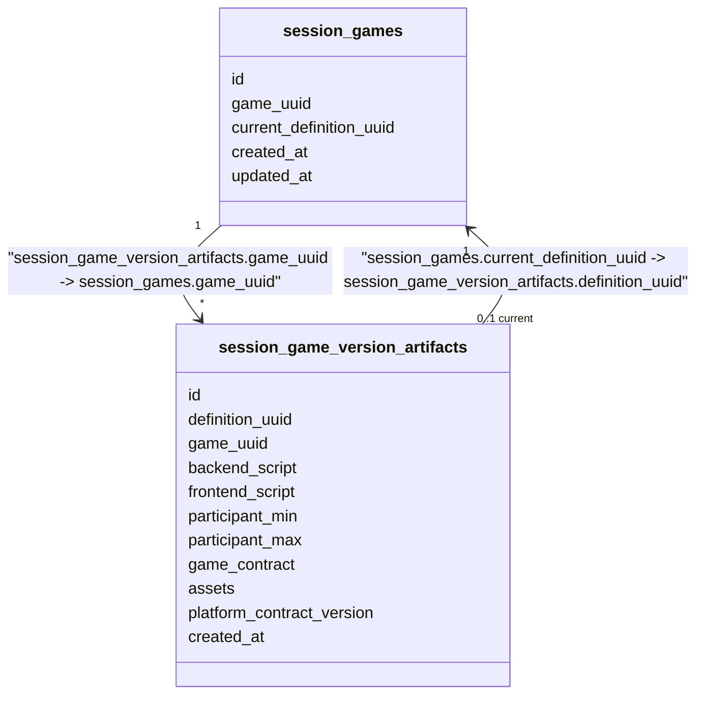
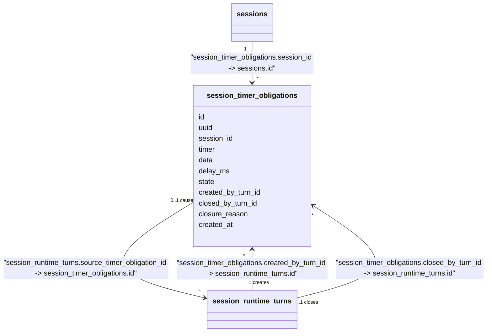
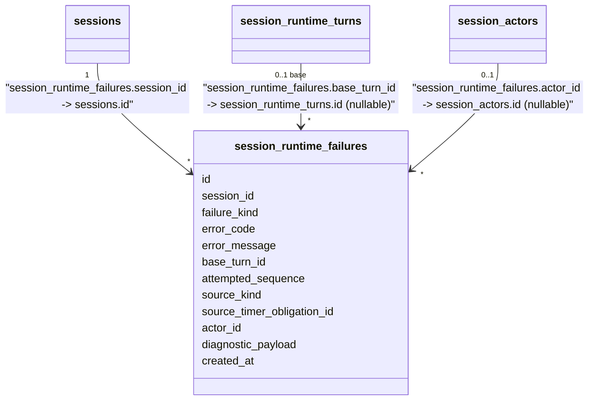

# Session Runtime - Data Model

Status: CURRENT IMPLEMENTATION

Game Management's own tables (`games`/`game_images`/`game_histories`) are documented in `game/docs/DATA_MODEL.md`, not here - no database transaction spans Game Management-owned and Session-Runtime-owned tables (`ARCHITECTURE.md -> State and Transaction Boundaries`). Game Management no longer owns any script/rule-versioning table of its own (`game_definitions`/`game_definition_histories` are retired) - Session Runtime owns the only executable Game Version Artifact table.

## Game Version Artifact Tables

`session_games`/`session_game_version_artifacts` are Session Runtime's own persisted copy of the executable Game Version Artifact (`session/docs/GAME_VERSION_ARTIFACT_MODEL.md`), read by `Create` and by every RUNNING-phase step. `session_games` holds one row per Game public UUID, pointing at its current pinnable version; `session_game_version_artifacts` holds one row per immutable version, storing the mandatory `backend_script`/`frontend_script`, the required `participant_min`/`participant_max` structural capacity range (`participant_max` nullable, meaning unlimited), plus the optional `game_contract`/`assets`/`platform_contract_version` fields the artifact model defines. `game_uuid` on the artifact table is Session Runtime's own addition beyond the artifact model itself, needed to resolve "current version for this Game" without a Game Management call - it is not part of `GameVersionArtifact`'s own canonical shape. The two tables carry a real, same-domain FK pair (not a logical reference): `session_game_version_artifacts.game_uuid -> session_games.game_uuid`, and `session_games.current_definition_uuid -> session_game_version_artifacts.definition_uuid`. Nothing yet populates these tables for a real, published Game version - the publish path is not yet implemented.



## Session Runtime Tables

Status: `session_runtime_turns.new_state` is the authoritative persisted Runtime state, populated by every RuntimeTurn-producing operation (`Start`/`SubmitPlayerEvent`/`CancelSession`/`ExpireTimer`) directly from the Executor's own output - no reconstruction step of any kind. `session_interactions` (a durable "open interaction" entity) is retired: the platform's closed Event/Command vocabulary has no OPEN_INTERACTION concept, so every game-defined player action is a generic `PLAYER_EVENT` with no platform-level open/closed lifecycle. `session_runtime_starts`/`session_cause_events` remain, now for reconstruction/audit purposes only, never the live-correctness path. The full accepted design remains recorded in `session/docs/SESSION_RUNTIME_PERSISTENCE_MODEL.md`.

```mermaid
classDiagram
    class sessions {
        id
        uuid
        game_definition_uuid
        host_actor_id
        phase
        lobby_expires_at
        started_at
        activity_expires_at
        current_turn_id
        terminal_at
        terminal_reason
        created_at
        updated_at
    }
    class session_actors {
        id
        session_id
        user_uuid
        semantic_presence
        created_at
    }
    class session_participants {
        id
        session_actor_id
        display_name
        active
        joined_at
        left_at
    }
    class join_codes {
        id
        session_id
        code
        created_at
        revoked_at
    }
    class session_requests {
        id
        operation
        idempotency_key
        user_uuid
        session_id
        request_payload
        outcome
        response_payload
        status
        created_at
    }
    class session_runtime_turns {
        id
        session_id
        sequence
        source_kind
        source_timer_obligation_id
        source_cause_event_id
        actor_id
        new_state
        created_at
    }
    class session_runtime_starts {
        id
        session_id
        seed
        root_parameters
        created_at
    }
    class session_cause_events {
        id
        session_id
        runtime_turn_id
        cause_kind
        actor_id
        payload
        created_at
    }

    sessions "1" --> "*" session_actors : "session_actors.session_id -> sessions.id"
    sessions "0..1 host" --> "1" session_actors : "sessions.host_actor_id -> session_actors.id"
    session_actors "1" --> "0..1" session_participants : "session_participants.session_actor_id -> session_actors.id"
    sessions "1" --> "*" join_codes : "join_codes.session_id -> sessions.id"
    sessions "0..1" --> "*" session_requests : "session_requests.session_id -> sessions.id"
    sessions "1" --> "*" session_runtime_turns : "session_runtime_turns.session_id -> sessions.id"
    session_runtime_turns "0..1" --> "*" sessions : "sessions.current_turn_id -> session_runtime_turns.id (logical, non-DB-enforced)"
    sessions "0..1" --> "1" session_runtime_starts : "session_runtime_starts.session_id -> sessions.id (one row per Session that completes Start)"
    sessions "1" --> "*" session_cause_events : "session_cause_events.session_id -> sessions.id (populated by SubmitPlayerEvent/CancelSession)"
    session_runtime_turns "0..1" --> "0..1" session_cause_events : "session_cause_events.runtime_turn_id -> session_runtime_turns.id (1:1)"
    session_cause_events "0..1 causes" --> "*" session_runtime_turns : "session_runtime_turns.source_cause_event_id -> session_cause_events.id"
```

`phase` is `LOBBY | RUNNING | TERMINAL` in the currently implemented behavior (Create/Join/Leave/Start/SubmitPlayerEvent/CancelSession/ExpireTimer). `started_at` is set only once Start commits a Session's first RuntimeTurn; it remains `NULL` for a Session still in `LOBBY` or one that fatally terminalized before ever running (`terminal_reason` = `RUNTIME_EXECUTION_FAILED`). `session_runtime_turns.new_state` is the authoritative Runtime state immediately after that Turn committed, stored opaque exactly as the Executor returned it - `source_timer_obligation_id` is populated by `Manager.ExpireTimer`'s own caused Turn; `source_cause_event_id` is populated by `SubmitPlayerEvent`/`CancelSession`'s own caused Turn.

`session_timer_obligations` is the durable Timer Obligation entity a committed RuntimeTurn schedules and later cancels/consumes, driven by a script's own `SCHEDULE_TIMER`/`CANCEL_TIMER` platform Commands: `id`, `uuid` (public identity), `session_id`, `timer` (the opaque identifier a script's commands address it by), `data` (JSONB, an optional passthrough payload echoed back unchanged on expiration - never part of a timer's identity), `delay_ms`, `state` (`ACTIVE | CONSUMED | CANCELLED`), `created_by_turn_id`, `closed_by_turn_id` (`NULL` for terminal-cleanup closure), `closure_reason`, `created_at`. A partial unique index enforces at most one `ACTIVE` row per `(session_id, timer)`. Scheduling an already-ACTIVE `timer` replaces it (the existing row is cancelled, a new one created) rather than being rejected.



`session_runtime_failures` is the durable fatal-diagnostic record, populated atomically alongside the Session's own `TERMINAL` transition by every RuntimeTurn-producing path's fatal branch (`Start`/`SubmitPlayerEvent`/`CancelSession`/`ExpireTimer`): `id`, `session_id`, `failure_kind` (`RUNTIME_EXECUTION`), `error_code` (the one stable code the Executor-driven fatal path records), `error_message`, `base_turn_id` (nullable - `NULL` only for a pre-first-Turn Start failure), `attempted_sequence`, `source_kind` (reuses `session_runtime_turns.source_kind`'s own vocabulary, including `SESSION_START`), `source_timer_obligation_id`/`actor_id` (nullable), `diagnostic_payload` (JSONB, a minimal `{"schema_version": 1}` envelope), `created_at`. Not created for an expected script rejection, an authored game-completion/failure outcome, or a host `CancelSession` the script itself reacted to, since none of those is an infrastructure failure.



`sequence` currently reaches 2 for a Session with one accepted player event (Start's first Turn, then the event's own). `session_runtime_turns.new_state` is read directly for `sessions.current_turn_id` as the Session's current authoritative Runtime state - no reconstruction step of any kind. `session_runtime_starts` holds exactly one row per Session that completes Start; `seed` stores the drawn `uint64` bit pattern reinterpreted as a signed `BIGINT` (PostgreSQL has no unsigned 64-bit type); `root_parameters` is JSONB, currently always an empty object (nothing yet supplies custom Session-start parameters). `session_cause_events` is the shared satellite table a RuntimeTurn cause with no existing normalized home writes into, discriminated by `cause_kind`: `PLAYER_EVENT` (`SubmitPlayerEvent`, payload the encoded platform Event) and `SESSION_CANCELLED` (`CancelSession`, when the authored script itself reacts to `SESSION_CANCELLED` - empty payload; a script-rejected cancellation persists no cause event at all, only `sessions.terminal_reason`).

## Relationship Types

No database-enforced foreign key constraints were found in the rest of Session Runtime's current migration SQL - `session_games`/`session_game_version_artifacts` (added by WORK-0034) are the one exception, a real FK pair, since both tables are Session-owned (see Game Version Artifact Tables above).

Database-enforced foreign keys:

- `session_game_version_artifacts.game_uuid -> session_games.game_uuid`
- `session_games.current_definition_uuid -> session_game_version_artifacts.definition_uuid`

Logical persisted references:

- `session_actors.session_id -> sessions.id`
- `sessions.host_actor_id -> session_actors.id`
- `session_participants.session_actor_id -> session_actors.id`
- `join_codes.session_id -> sessions.id`
- `session_requests.session_id -> sessions.id`
- `session_runtime_turns.session_id -> sessions.id`
- `sessions.current_turn_id -> session_runtime_turns.id` (SESSION-ADR-0022)
- `session_runtime_starts.session_id -> sessions.id` (one row per Session that completes Start)
- `session_cause_events.session_id -> sessions.id` (populated by `PLAYER_EVENT` (SubmitPlayerEvent) and `SESSION_CANCELLED` (CancelSession, accepted-reaction path only) cause_kinds)
- `session_cause_events.runtime_turn_id -> session_runtime_turns.id` (1:1)
- `session_runtime_turns.source_cause_event_id -> session_cause_events.id` (nullable - populated only for a `PLAYER_EVENT`- or `SESSION_CANCELLED`-sourced Turn)
- `session_runtime_failures.session_id -> sessions.id`
- `session_runtime_failures.base_turn_id -> session_runtime_turns.id` (nullable - `NULL` only for a pre-first-Turn Start failure)
- `session_runtime_failures.source_timer_obligation_id -> session_timer_obligations.id` (nullable)
- `session_runtime_failures.actor_id -> session_actors.id` (nullable)

`sessions.game_definition_uuid` and every RUNNING-phase step's own pinned-artifact read (`Join`/`Start`/`SubmitPlayerEvent`/`CancelSession`/`ExpireTimer`) resolve entirely from Session Runtime's own `session_game_version_artifacts.definition_uuid` - no cross-domain read to Game Management exists anywhere in the live path. No database FK exists between the two domains either way (`ARCHITECTURE.md -> Cross-Domain Public Entity References`).

Logical cross-domain references (no database FK, different bounded context):

- `session_actors.user_uuid -> Identity.User` (Identity)
- `session_requests.user_uuid -> Identity.User` (Identity)
